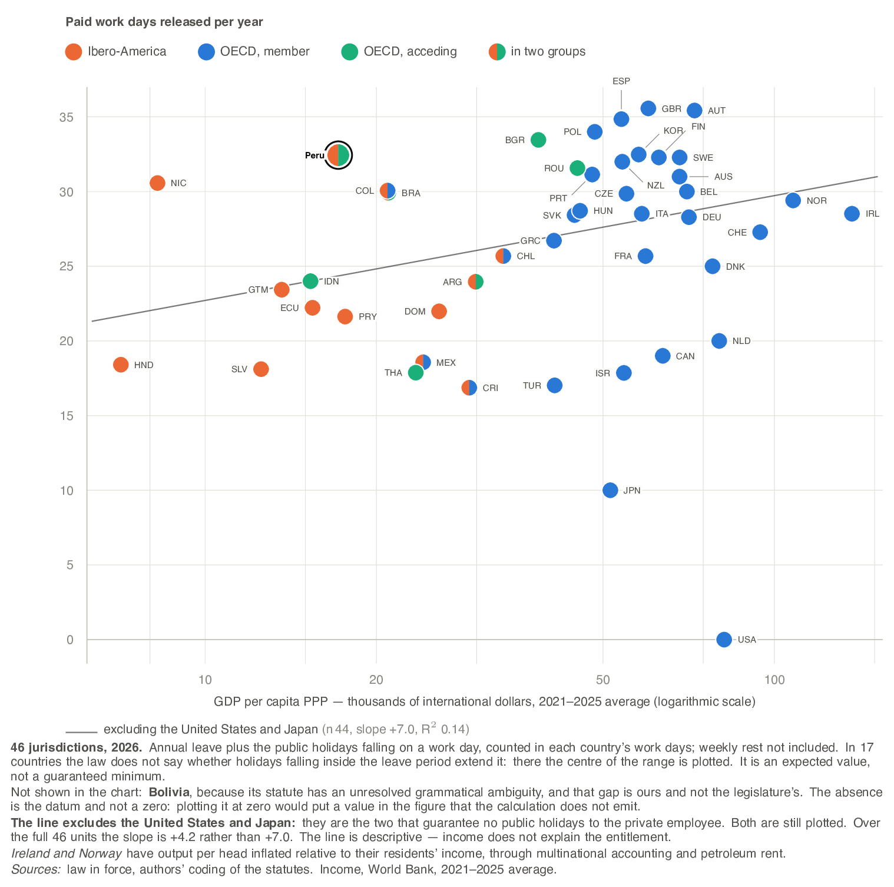

# Statutory public holidays and annual leave in Peru, Ibero-America and the OECD

Kristian López Vargas

## Key messages

**Peru's statutory rest floor is above both the Ibero-American and the OECD
median. The total, however, is composed differently against each benchmark.**

- **Level.** The statutory entitlements of a reference worker in Peru amount to
  **32.4 paid days of work released per year** under this study's
  assumptions, 12.5 % of their working year. The Ibero-American
  median is 22.8 days and the OECD one 28.5. **It is
  not an
  enforceable floor, and that belongs in the same sentence**: the total nets out
  the expected overlap between holidays and leave assuming rest is placed
  uniformly across the year, so it is an expected value of the model and not a
  quantity the law compels. The two components that make it up are written
  entitlements.

- **Composition.** The gap does not come from the same entitlement in both
  cases. Against the OECD, Peru's annual leave entitlement is equivalent
  —4.29 weeks against 4.00— and the distance
  is set by public holidays: 12 expected effective against a
  median of 8. Against Ibero-America the reverse holds.
  Public holidays and annual leave are distinct instruments and are not
  interchangeable.

- **Why these figures differ from the familiar ones.** The available comparative
  indices do not uniformly preserve the unit in which each statute counts days,
  and therefore cannot answer this comparison directly — particularly for statutes
  written in calendar days, as Peru's is.

- **Implication.** Before debating whether the statutory floor should rise or
  fall, the diagnosis has to separate the two entitlements and be complemented
  with evidence on compliance and on effective take-up, which this work does not
  measure.

*Scope of these figures: they describe the **entitlement the law grants** a
reference worker —twelve months of continuous service, formal private sector—; they
do not measure take-up, compliance, well-being or productivity. Each observation is
a **reference jurisdiction, not a national average**.*

*Keywords:* public holidays · annual leave · statutory rest · cross-country
comparison · Peru · Ibero-America · OECD. *JEL codes:* J81 · J88 · K31 · C81.

**For researchers.** This dataset **does not replace** the existing comparative
series and does not seek to: they are annual, cover half a century, and this is
two cuts. What it contributes is different and complementary — a recent legal
recoding that preserves, cell by cell, the **statutory counting unit**, the
seniority schedule, the placement rule, the boundary between the two entitlements
and provenance down to the statute. It serves to **audit and correct** the
existing series where their aggregation loses information, and to extend
observation to the current cut. Anyone who needs a long panel should keep using
those; anyone who needs to know what kind of day is being counted cannot.

---

## Executive summary

### What we found

We measured, by reading the statutes, the rest that the law guarantees in
47 jurisdictions of Ibero-America, the OECD and the accession
countries, with two entitlements in the same design: paid public holidays and
minimum annual leave.

There are two time cuts, 2016 and 2026, and their strength differs by
entitlement. For public holidays the 2016 cut is verified against source in 26 units and partly in 11.
For annual leave it is **confirmed in 41 of the
45 units with a recorded entitlement**, with 0
still assumed. The difference orders this whole work: «it was sought and confirmed
unchanged» is not the same as «no amending statute was found», and that
distinction is in the data, cell by cell.

The measure is the **released paid work day**: a day the reference worker would
have worked and does not work, while being paid. A public holiday falling on
their weekly rest releases nothing and does not count.

Peru sits above both reference medians. Its composition, by contrast, is
atypical: the annual leave entitlement is in line with the OECD and the number of
public holidays that actually release a work day is high.

### Why it matters

Public debate on rest days usually rests on the number of holidays in the
calendar or on comparative indices of labour regulation. Neither answers the
question that matters for policy, and there is literature that lets us say why
with precision.

**What is known about the cost.** The cleanest available estimate exploits an
elegant source of variation: when a public holiday falls on a weekend and the
statute does not substitute it, the country gains a working day quasi-randomly,
with no change in the law.

The work exploiting that variation —Rosso and Wagner, across some two hundred
countries— finds that **the cost of an additional public holiday is substantially
lower than the naive calculation** —output divided by the working days of the
year— because part of the activity shifts to other days and because hospitality
and tourism raise their takings on precisely that day. The effect concentrates in
manufacturing and does not appear in mining or agriculture. The same work reports
fewer workplace accidents and a short-run rise in self-reported happiness in
years with more transitory holidays.

*This report does not reproduce that work's point magnitudes, and the omission is
deliberate. Its repository is not accessible, the figures in circulation come from
secondary sources, and this project's own literature review flagged that reference
as pending primary capture before being cited. Citing a specific elasticity backed
by a chain we cannot close would be the very defect this document charges to
others. The sign and the order of magnitude are robust in the literature; the
exact number will be published once the source is captured.*

**What is known about the effect on work.** An annual leave mandate does not
dissolve into compensating adjustments: Altonji and Oldham find that annual hours
worked fall by close to a full week for each week of paid leave the law grants.
The same work documents two facts this project assumed for construct reasons and
which thereby gain external support: leave is determined by employer policy rather
than by individual bargaining, and it is strongly tied to seniority.

**Why composition is not an accounting detail.** Alesina, Glaeser and Sacerdote
attribute the bulk of the hours-worked gap between the United States and Europe to
labour regulation, and rule out the usual alternatives —taxes explain little, and
culture cannot explain it because Europeans worked more than Americans until the
nineteen-sixties—. The mechanism they propose is a **social multiplier of
leisure**: the return to free time rises when more people take it at the same
time.

That mechanism connects directly to this report's second result. If the value of
rest depends on how many people rest at once, then **a public holiday and a day of
annual leave are not interchangeable goods**, even though they count the same in
the total: the holiday is synchronised by construction and the leave day is not. A
jurisdiction that reaches its total through holidays is buying a different good
from one that reaches it through leave, and the difference is not one of degree.

**What the literature does not yet provide.** There is no closed framework that
allows one to say what the optimal level of statutory rest is for a given country.
There are cost estimates, there is evidence of benefits in health and recovery,
and there is a coordination mechanism that suggests multiple equilibria —which
implies that cross-country comparison does not identify an optimum, because each
country may sit at a different equilibrium—. This report does not fill that gap:
it measures the statutory floor and makes it comparable, which is the precondition
for any discussion about level.

**And that is why the measurement defect matters.** The calendar does not
distinguish the holiday that releases a work day from the one that falls on weekly
rest —and the identification strategy of the literature just cited depends on that
distinction—. Comparative indices treat annual leave as a quantity of days without
declaring **days of what**, and statutes do not count days of the same thing:
Peru's grants calendar days, Germany's *Werktage*, Ontario's weeks. Without
resolving that, neither cost nor benefit can be assigned to the right country.

### What decision-makers should do differently

**Separate the two instruments in the diagnosis.** One and the same total may come
from many holidays with median leave or from the reverse, and they are not the
same good: holidays are dates common to everyone, leave is placed and its
placement is negotiated.

**Declare the counting unit when citing any international comparison**, one's own
or another's. It is the information that makes a figure recalculable.

**Complement with evidence on compliance and take-up** before concluding about
level. The statutory floor is a necessary condition and does not describe what
happens.

### What it does not support concluding

This work describes law in force, not practice. **We do not claim to be more
accurate** than the existing indices: we claim to be auditable and reproducible to
the extent the reliability section documents. It does not identify causal effects,
does not estimate an optimal level, and does not measure compliance or take-up.
**Unverified absence is not absence**: a delta of zero between cuts may mean there
was no reform or that none was sought.

---

# Part I · How much rest the law guarantees

## 1. Peru's statutory floor sits above both of its benchmarks

**Table 1.** Paid work days released per year, 2026 cut

| group | n | median rest, in days | median % of the working year | median effective holidays |
|---|---:|---:|---:|---:|
| Peru | 1 | 32.4 | 12.5 % | 12 |
| Ibero-America | 14 | 22.8 | 8.5 % | 9 |
| OECD | 32 | 28.5 | 11.0 % | 8 |

*Source:* authors' calculations over 46 jurisdictions with
complete measurement. The fraction is computed on each jurisdiction's own working
year. *Note:* where the statute does not determine whether holidays falling inside
the leave period extend it, the result is an interval and not a point: that is
17 jurisdictions.

Peru's position above both medians is stable across the available calculation
conventions. Under the common five-day frame —which ignores actual working time
and treats every jurisdiction alike— the Peruvian figure is
32.4 days.

The next exhibit gives the full set, unaggregated. It is published in the body and
not in an annex on purpose: a reader who wants to check where Peru stands against
a specific country —and not against a median— has to be able to do so without
changing documents.

**Table 2.** Statutory rest in the 46 jurisdictions with
complete measurement, 2026 cut

| # | country | jurisdiction | group | week | leave | expected effective holidays | rest, in days | % of working year | # by fraction |
|---:|---|---|---|---:|---:|---:|---:|---:|---:|
| 1 | United Kingdom | London | OECD | 5 | 28.0 | 8.0 | 35.1–36.0 | 13.5 % | 1 |
| 2 | Austria | Vienna | OECD | 5 | 25.0 | 10.4 | 35.4 | 13.6 % | 2 |
| 3 | Spain | Madrid | OECD | 5 | 21.4 | 14.0 | 34.3–35.4 | 13.2 % | 3 |
| 4 | Poland | Warsaw | OECD | 5 | 20.0 | 14.0 | 34.0 | 13.1 % | 4 |
| 5 | Bulgaria | Sofia | — | 5 | 20.0 | 14.0 | 32.9–34.0 | 12.7 % | 5 |
| 6 | South Korea | Seoul | OECD | 5 | 15.0 | 18.0 | 32.0–33.0 | 12.3 % | 6 |
| **7** | **Peru** | **Lima** | **Ibero-America** | **5** | **21.4** | **12.0** | **32.4** | **12.5 %** | **7** |
| 8 | Finland | Helsinki | OECD | 5 | 25.0 | 7.3 | 32.3 | 12.4 % | 8 |
| 9 | Sweden | Stockholm | OECD | 5 | 25.0 | 7.3 | 32.3 | 12.4 % | 9 |
| 10 | New Zealand | Auckland | OECD | 5 | 20.0 | 12.0 | 32.0 | 12.3 % | 10 |
| 11 | Romania | Bucharest | — | 5 | 20.0 | 11.6 | 31.6 | 12.1 % | 11 |
| 12 | Portugal | Lisbon | OECD | 5 | 22.0 | 9.1 | 31.1 | 12.0 % | 12 |
| 13 | Australia | Sydney | OECD | 5 | 20.0 | 11.0 | 31.0 | 11.9 % | 13 |
| 14 | Nicaragua | Managua | Ibero-America | 5 | 21.4 | 9.1 | 30.6 | 11.8 % | 14 |
| 15 | Colombia | Bogotá | Ibero-America · OECD | 5 | 12.5 | 18.0 | 29.6–30.5 | 11.4 % | 15 |
| 16 | Belgium | Brussels | OECD | 5 | 20.0 | 10.0 | 30.0 | 11.5 % | 16 |
| 17 | Brazil | São Paulo | Ibero-America | 5 | 21.4 | 8.9 | 29.6–30.3 | 11.4 % | 17 |
| 18 | Czechia | Prague | OECD | 5 | 20.0 | 9.9 | 29.9 | 11.5 % | 18 |
| 19 | Norway | Oslo | OECD | 5 | 20.8 | 8.6 | 29.4 | 11.3 % | 19 |
| 20 | Hungary | Budapest | OECD | 5 | 20.0 | 8.7 | 28.7 | 11.0 % | 20 |
| 21 | Italy | Rome | OECD | 5 | 20.0 | 8.9 | 28.2–28.9 | 10.8 % | 21 |
| 22 | Ireland | Dublin | OECD | 5 | 20.0 | 8.9 | 28.2–28.9 | 10.8 % | 22 |
| 23 | Slovakia | Bratislava | OECD | 5 | 20.0 | 8.4 | 28.4 | 10.9 % | 23 |
| | **median of the set** | | | | | | **28.4** | **10.9 %** | |
| 24 | Germany | Berlin | OECD | 5 | 20.0 | 8.3 | 28.3 | 10.9 % | 24 |
| 25 | Switzerland | Zurich | OECD | 5 | 20.0 | 7.6 | 27.0–27.6 | 10.4 % | 25 |
| 26 | Greece | Athens | OECD | 5 | 20.0 | 6.7 | 26.7 | 10.3 % | 26 |
| 27 | Chile | Santiago | Ibero-America · OECD | 5 | 15.0 | 11.0 | 25.4–26.0 | 9.8 % | 27 |
| 28 | France | Paris | OECD | 5 | 25.0 | 0.7 | 25.6–25.7 | 9.9 % | 28 |
| 29 | Denmark | Copenhagen | OECD | 5 | 25.0 | 0.0 | 25.0 | 9.6 % | 29 |
| 30 | Indonesia | Jakarta | — | 5 | 12.0 | 12.0 | 24.0 | 9.2 % | 30 |
| 31 | Argentina | Buenos Aires | Ibero-America | 5.5 | 11.0 | 13.2 | 23.7–24.2 | 8.3 % | 33 |
| 32 | Guatemala | Guatemala City | Ibero-America | 5 | 15.0 | 8.4 | 23.4 | 9.0 % | 31 |
| 33 | Ecuador | Guayaquil | Ibero-America | 5 | 10.7 | 12.0 | 22.2 | 8.5 % | 32 |
| 34 | Dominican Republic | Santo Domingo | Ibero-America | 5.5 | 12.8 | 9.4 | 21.8–22.2 | 7.6 % | 36 |
| 35 | Paraguay | Asunción | Ibero-America | 5 | 12.0 | 9.9 | 21.4–21.9 | 8.2 % | 34 |
| 36 | Netherlands | Amsterdam | OECD | 5 | 20.0 | 0.0 | 20.0 | 7.7 % | 35 |
| 37 | Canada | Toronto | OECD | 5 | 10.0 | 9.0 | 19.0 | 7.3 % | 37 |
| 38 | Mexico | Mexico City | Ibero-America · OECD | 5 | 12.0 | 6.6 | 18.6 | 7.1 % | 38 |
| 39 | Honduras | Tegucigalpa | Ibero-America | 5 | 10.0 | 8.6 | 18.2–18.6 | 7.0 % | 39 |
| 40 | El Salvador | San Salvador | Ibero-America | 5 | 10.7 | 7.7 | 18.1 | 7.0 % | 40 |
| 41 | Thailand | Bangkok | — | 5 | 5.0 | 13.0 | 17.8–18.0 | 6.8 % | 41 |
| 42 | Israel | Jerusalem | OECD | 5 | 11.4 | 6.4 | 17.9 | 6.9 % | 42 |
| 43 | Türkiye | Istanbul | OECD | 5 | 11.7 | 5.4 | 17.0 | 6.5 % | 43 |
| 44 | Costa Rica | San José | Ibero-America · OECD | 5 | 10.0 | 7.0 | 16.7–17.0 | 6.4 % | 44 |
| 45 | Japan | Tokyo | OECD | 5 | 10.0 | 0.0 | 10.0 | 3.8 % | 45 |
| 46 | United States | New York | OECD | 5 | 0.0 | 0.0 | 0.0 | 0.0 % | 46 |

*Source:* authors' calculations. Ordered by released work days. The last column
gives the rank under the alternative criterion —fraction of the working year—;
that the two nearly coincide is a property of the current data and not of the
method, and the section on the construction of the measure explains the three
criteria. *Note:* an interval in the rest column indicates that the statute does
not determine whether holidays falling inside the leave period extend it.

### 1.1. How to read the distribution

Three features of the preceding exhibit do not show up in a median.

**The set is continuous except at its lower end.** There is no group of generous
jurisdictions and another of restrictive ones with a gap between them: over most
of the range, the median difference between consecutive positions is
0.43 days, below the declared uncertainty of the measurement
itself. The practical consequence is that
**the ordinal rank conveys less information than it appears to**: a handful of
places of distance may correspond to less than one work day per year. That is why
this report uses the rank only inside exhibits and never in a claim.

**The exception is at the bottom, and the law explains it.** The United States and
Japan sit apart from the rest by a step of 10.0 days, which is
23 times the median difference across the rest of the
ranking. Both belong
to the group whose holiday calendar creates no obligation enforceable against the
private employer; and unlike Denmark and the Netherlands, which are in that same
situation, they do not offset it with a broad leave entitlement. The next section
develops that case.

**The upper part concentrates** jurisdictions whose leave statute grants five
weeks or more. Peru is at the top through a different combination, which is the
subject of the next section.

**Peru's distance to each benchmark is not the same.** Against the Ibero-American
median —22.8 days— the difference is wide; against the OECD one
—28.5— it is narrow. One and the same statement, «Peru is above the
median», describes two different situations depending on the group, and that is
why the headline message names both.

### 1.2. What these figures mean in terms of the worker

Translating the unit helps with scale. Peru's 32.4 released work days
add up both entitlements: the leave the law obliges employers to grant and the
holidays that actually release a working day. Expressed as a fraction of the time
the reference worker would have spent working, it is 12.5 % of their
working year.

That figure does not say the following. It does not say how many days a Peruvian
worker rests: it says how many they can demand. The distance between the two
—compliance, informality, effective take-up of the leave entitlement— is
substantial in any country and this work does not measure it. In an economy with
high informality, moreover, the statutory floor describes the situation of a
fraction of the employed population, not of the whole.

### 1.3. The level is not explained by national income

A reader who sees Peru above both medians immediately asks the obvious question:
if statutory rest rose with wealth, Peru's position would say nothing about its
legislation and everything about its income level. The question has an answer in
these data.

**Figure 1.** Statutory rest and output per head, 2026 cut

There is an association and it is weak. The line fitted over the
44 jurisdictions that remain once United States and Japan
are excluded —the two that guarantee no public holiday at all to the private
employee— rises 7.0 days for each tenfold multiplication of
income, with a coefficient of determination of 0.14. **That exclusion is
not innocuous, which is why it is stated here:** the two excluded are among those
guaranteeing the least rest, and without excluding them the slope is
4.2. The association this figure shows is the strongest
that these data admit, not the only one.

**The magnitude is what matters, and it can be read without statistics.** Across
the entire income range of the set —from one end to the other, a factor of more
than ten— the line describes a span of 9.0 days. The distance
separating the most generous jurisdiction from the least generous is
35.6 days. Income tracks part of the variation and leaves out the
greater part.

**And Peru sits 8.1 days above what its income level predicts** — a
distance almost as large as the entire span the line describes from end to end.
Its position is not a by-product of its income.

**And the association is not merely weak: its sign depends on how it is
weighted.** Weighting each jurisdiction by its population, the slope moves from
4.2 to −15.6 days and changes
direction. The change is produced by a single observation: the United States,
whose population is 16 % of the set and whose statutory rest is
zero. That slope is a correct measurement and it rests on one point, and both
things have to be said together. The line this report publishes is the one that
depends on no particular observation.

Three warnings about how to read this figure, and all three bound it in the same
direction.

**The line is descriptive and estimates no effect.** There is no sample here: the
set is the entire population of the reference group, so a fitted line does not even
have the inferential excuse. It describes a shape; it does not identify a
relationship.

**Output per head is context and not explanation.** This work does not measure why
a legislature grants the days it grants, and none of the above should be read as
income determining them, or failing to.

**Ireland and Norway have output per head inflated** relative to their residents'
income: the former through multinational accounting, the latter through petroleum
rent. Both are declared in the figure's note.

## 2. A similar total can come from very different entitlements

**Table 3.** Decomposition of the total into annual leave and expected effective
public holidays, 2026 cut

| component | Peru | OECD median | Ibero-America median |
|---|---:|---:|---:|
| Annual leave, in working weeks | 4.29 | 4.00 | 2.40 |
| Effective public holidays, in weeks | 2.40 | 1.70 | 1.80 |
| Holidays lost to weekly rest, in weeks | 0.80 | 0.29 | 0.54 |

*Source:* authors' calculations. **The holiday figure is an expectation, not a
count**, and can therefore be fractional: a fixed-date holiday that the law does
not rescue when it falls on a weekend releases a day in five years out of seven,
and enters weighted by that probability rather than by the specific year of the
cut. Holidays the law rescues, and those anchored to Easter, enter as integers
because their day of the week is deterministic.

Against the OECD, Peru's annual leave entitlement is equivalent
—4.29 weeks against 4.00— and the whole distance
is set by public holidays. Against Ibero-America the relation reverses: the
regional median for leave is 2.40 weeks, well below Peru's, and
there the leave entitlement explains most of the difference.

That the same position is reached by different routes is not a statistical
curiosity. It has three consequences for policy design.

### 2.1. In some jurisdictions the holiday calendar creates no entitlement at all

The extreme case of the preceding distinction is stated with names because it
explains positions in the ranking that would otherwise look like errors.

In 4 jurisdictions of the set —**the United
States, Japan, Denmark and the Netherlands**— the public holiday calendar
**creates no obligation enforceable against the private employer**. The days
exist, they are in the official calendar and in several cases they close the
public administration, but the law does not require a private firm to grant paid
rest for them: whatever exists in the private sector arises from collective
agreement or contract, not from statute.

Another 2 sit halfway: **France
declares eleven holidays and only one is enforceable**, the first of May. It is
not that its calendar is short; it is that the rest of its days create no
individual entitlement against the employer. **Costa Rica** is the other case,
with a minority of its days outside the mandatory regime.

Across the whole set, 58 of the
569.5 declared holiday days in the 47
jurisdictions **have no enforceable backing**. That proportion is the direct
measure of how far counting calendars misleads.

Two consequences.

**The first concerns reading.** Any comparison that counts calendar days places
those jurisdictions in the upper half and Peru below several of them. Counting
enforceable entitlement, the relation reverses. This is not a technical nuance: it
is the difference between comparing calendars and comparing entitlements, and only
one of the two describes what a worker can claim.

**The second is substantive and bounds the scope of this work.** That the
statutory entitlement is nil does not mean the rest is — in those countries
effective coverage by agreement or by custom may be high, and this work does not
measure it. What the comparison shows is where rest is guaranteed **by law** as
against where it depends on bargaining. For a Peruvian policy discussion that
distinction is precisely the relevant one, because it is the one the legislature
can move.

**The two entitlements are allocated differently.** A public holiday is a fixed
date that coincides for the whole employed population: **it need not be requested
or negotiated**. Annual leave, by contrast, is placed, and its placement is
negotiated. An entitlement of equal size can yield very unequal rest depending on
who decides when it is taken, and this project's own evidence on placement rules
shows that in a good share of jurisdictions disagreement is resolved by the
employer. How much of that design difference translates into a difference in
effective enjoyment is a compliance question, which this work does not measure.

**They produce different economic effects.** The holiday is synchronised: it
concentrates consumption, travel and demand for services on known dates, and its
cost to the employer concentrates likewise. Leave is spread across the year. The
same total can correspond to very different seasonality profiles, and a reform
that moves the total through one channel or the other does not produce the same
effect.

**They are reformed by different routes.** Adding a public holiday is a discrete
legislative act, of low political cost and immediate effect; changing the leave
regime touches the employment contract and usually requires negotiation. It is
reasonable to expect that this biases observed policy towards the cheap
instrument.

**This work's data are consistent with that hypothesis, and the comparison now
holds.** Among the units with both cuts captured, the holiday count moved in
21 of 45; the leave entitlement, in
4 of 45. The denominators are not
47 and that is worth stating: 2 units have
no 2016 holiday cut captured, and for them the panel shows a jump from zero that **is an absence, not
a change**. Counting it would invent a reform nobody measured.

For much of this work that comparison was unusable, and it is worth saying why it
no longer is. A delta of zero in leave could mean there was no reform or that none
had been sought, and while the older cut was mostly assumed, its stillness measured
the state of the record and not that of the legislation. Today the 2016 cut has
41 cells whose no-change was **sought and confirmed** against
an official amendment index or a located instrument, 4 with their
reform captured and dated, and 0 assumed. The stillness of the
leave entitlement is a finding about legislation, not a shadow of our search.

**What the data do not say is why**, and there the abstention stands: one instrument
being used more than the other is consistent with the political-cost argument and
with at least two others this design does not separate. One: the leave entitlement
may sit near a ceiling of international convergence, in which case the stillness
is saturation rather than cost. Two: the effective route of increase may be
collective bargaining rather than statute, in which case the statute stays still
while effective rest moves outside our measure — consistent with a reform ledger
that records changes to the rules of enjoyment and none to the quantity. **The
asymmetry is published; its cause is not**, and the alternatives are named so that
the reader can argue with us.

For the Peruvian case, the reading is that **its high position against the OECD
rests on the synchronised instrument and not on the individual one**. Any
discussion about the level of the statutory floor should begin by deciding which
of the two is being talked about.

## 3. The change over the decade is uneven, and its provenance has to be read

Before the exhibit, a distinction that governs this whole section and that the
data record explicitly. A 2016 value may be **verified** against the statute in
force at the time, or recorded as **assumed**, which means «no amending statute
was found between the two cuts». They are not the same, and confusing them is the
error this project set out to correct in the material it started from.

The split is asymmetric between the two entitlements and is worth knowing before
reading any delta. For **public holidays**, the 2016 cut was captured against
source in most jurisdictions. For **annual leave** there was a dedicated
verification campaign, and its result is that 41 units have
their no-change confirmed against an official index of amendments to the article
or against a located and dated instrument, with 0 still
assumed. The jurisdictions with a captured leave reform in the period are
4, and they are also the only ones with two recorded versions of
their statute; among them Mexico's, whose first-year entitlement went from six to
twelve working days with effect in January 2023 by decree published in December
2022, and Israel's, which raised the entitlement with effect in January 2017.

From this followed a reading rule that now applies only to the assumed ones: **an
unverified delta of zero is not evidence of legislative stability.** It is the
absence of a positive search for
amendments, and it is declared as such.

**Table 4.** Change in the holiday count between 2016 and 2026

| country | jurisdiction | 2016 cut | 2026 cut | change | of which enforceable in 2026 | provenance of the 2016 cut |
|---|---|---:|---:|---:|---:|---|
| South Korea | Seoul | 1 | 18 | +17 | 18 | verified |
| Greece | Athens | 4 | 9 | +5 | 9 | partly verified |
| Romania | Bucharest | 12 | 17 | +5 | 17 | partly verified |
| Peru | Lima | 12 | 16 | +4 | 16 | verified |
| Portugal | Lisbon | 9 | 13 | +4 | 13 | verified |
| Ecuador | Guayaquil | 10 | 12 | +2 | 12 | verified |
| Argentina | Buenos Aires | 15 | 16 | +1 | 16 | verified |
| Brazil | São Paulo | 11 | 12 | +1 | 12 | verified |
| Chile | Santiago | 15 | 16 | +1 | 16 | verified |
| Germany | Berlin | 9 | 10 | +1 | 10 | verified |
| Hungary | Budapest | 10 | 11 | +1 | 11 | partly verified |
| Ireland | Dublin | 9 | 10 | +1 | 10 | verified |
| Nicaragua | Managua | 11 | 12 | +1 | 12 | verified |
| New Zealand | Auckland | 11 | 12 | +1 | 12 | partly verified |
| Poland | Warsaw | 13 | 14 | +1 | 14 | verified |
| Paraguay | Asunción | 12 | 13 | +1 | 13 | verified |
| Türkiye | Istanbul | 6 | 8 | +1 | 8 | verified |
| United States | New York | 10 | 11 | +1 | 0 | verified |
| Austria | Vienna | 14 | 13 | -1 | 13 | verified |
| Denmark | Copenhagen | 11 | 10 | -1 | 0 | verified |
| Slovakia | Bratislava | 15 | 11 | -4 | 11 | verified |

*Source:* authors' calculations over the two cuts. *Note:* the observed change
includes temporary measures in force in the year of the cut; see the warning on
Slovakia immediately below.

**A temporary measure can read as a permanent reform, and in this exhibit it
does.** Eslovaquia records a fall of
4 holidays between the two cuts, and both figures are
correct. But the **permanent** fall is 2: the
remaining 2 days are suspended by a transitional
provision that expires at the close of the cut year and restores them the next.
This study's cut falls precisely in the only year in which the suspension is
active.

The case goes beyond Slovakia because **the defect belongs to the two-cut design
and not to the capture**. A measurement at two moments does not by itself
distinguish a reform from a transitory measure that happens to be in force on the
chosen date; both look the same. And a source that publishes one scalar per year
cannot distinguish them either, because the difference lies not in the value but
in the legal basis that produces it.

What this dataset adds is exactly that basis: it records whether a change is
permanent or temporary, with the statute that provides for it and the date on
which it expires, so that the warning travels attached to the figure in the
appendix of the affected unit. Anyone using that delta for a cross-country
comparison should use the permanent one; anyone studying the effective calendar of
the current year, the observed one. **The correct figure depends on the question,
and that is why both are published with their basis.**

The provenance of this exhibit is weaker than that of the rest of the document,
and that is why the caveat sits next to the figure and not in an annex. **The
last column states, unit by unit, where the 2016 cut comes from**, and it is
worth reading before the change itself: the same delta weighs differently
depending on whether the 2016 statute was read or merely assumed unchanged.

What the exhibit does **not** show matters too. Only units whose count moved
appear here; the remaining 26 have no row, and that absence groups
different things: 9 with the 2016 cut verified,
7 partly verified, 8 assumed unchanged
and 2 not captured. Only the first group licenses reading the
zero as **verified absence of reform**; in the assumed ones, the zero means
nobody looked. The 2016 cut is not captured for
2 jurisdictions, because their calendar is set by
decree each year.

## 4. How one of these figures is built: the Peruvian case step by step

This section reconstructs Peru's figure from the legal text to the published
number, as an illustration of the procedure. Any other jurisdiction is derived
with the same steps, and each unit's verification appendix walks them cell by
cell.

### 4.1. Where the leave entitlement comes from

The Peruvian statute grants **30 days** of annual leave. The first
step, and the one that introduces most error if skipped, is to ask **days of
what**: «Decreto Legislativo 713», which consolidates the legislation on paid
rest, counts them in **calendar days** and not in working days. Thirty consecutive
days include the Sundays.

Converting them to a comparable magnitude requires no assumption about working
time. A calendar day is a seventh of a week, whatever is worked, so
30 calendar days are **4.29 weeks of entitlement**.
That is the figure that depends on no convention.

Expressing it in work days does require fixing how many days the week has. On the
five-day frame, 4.29 weeks are **21.4 work days**. It is
a multiplication, not an additional assumption: it changes the label, not the
entitlement.

This is where the standard comparison breaks. The most widely used comparative
index records Peru's 30 days without converting them, and for Germany
converts from *Werktage* to a five-day week. The two numbers end up in the same
column meaning different things.

### 4.2. Where the number of public holidays comes from

The Peruvian calendar declares more holidays than actually release a work day, and
the difference matters. Two filters apply in order.

**First, the regime.** Only holidays the law declares to be of mandatory paid rest
count. Those of optional observance, or those without a national mandate, fall
outside —not because they are worth less, but because they are not an entitlement
enforceable by the reference worker.

**Second, the day they fall on.** A holiday falling on weekly rest releases no
working day. At the 2026 cut, **12 expected effective
holidays** release a work day in Peru, against a median of
8 across the set.

The word **expected** is not decoration. A fixed-date holiday that the law does not
rescue when it falls on a weekend releases a day in five years out of seven, and
enters weighted by that probability rather than by the accident of the specific
year. The alternative —counting 2026 as it actually fell— would make a
jurisdiction's figure move year to year through calendar rotation and not through
reform, which is exactly what this work wants to be able to distinguish. Holidays
anchored to Easter enter as integers: Easter is always a Sunday, so Good Friday is
a Friday every year.

### 4.3. Why the total is not the sum

Adding the two entitlements requires resolving what happens when a holiday falls
**inside** the leave period. There are two possible regimes and each jurisdiction's
statute picks one: either the holiday **extends** the leave —and then the two
entitlements add— or it **is counted against** it, and then the worker does not
gain that day twice over.

Peru belongs to the second regime. That is why its total, **32.4
released work days**, is smaller than the sum of 21.4 and
12: the overlap between the two entitlements is netted out.

That netting **is an expectation and not an entitlement read from the statute**,
and the distinction matters because it changes what the figure means. The law does
not say how many holidays will fall inside a worker's leave: it depends on when
they take it. The discount is obtained by assuming that the start of the leave
period is uniformly distributed across the year, which is our assumption and not a
reading of the legal text. Consequently, **the published total is not an
enforceable minimum but an expected value under that distribution**: the minimum
the law guarantees with certainty is somewhat lower, and the attainable maximum,
somewhat higher.

And the uniformity assumption has a known direction. Leave is not evenly spread:
it concentrates in summer and around the end-of-year holidays, which is also where
public holidays accumulate. If that concentration is real —and there is little
doubt that it is— the effective overlap is **larger** than this calculation nets
out, so the published total **overstates** rest in the jurisdictions that count
holidays against the leave period. It is not corrected because correcting it would
require effective placement data this work does not have; it is declared because
the bias has a sign and the reader needs to know which.

It is a construct decision with consequences, and that is why it is declared: two
jurisdictions with identical nominal entitlements can differ by more than a day on
account of this regime alone.

### 4.4. The dimensionless figure

32.4 released days over the Peruvian working year are
**12.5 %**. This is the figure to cite in a comparison, because a
released day for someone who works six days a week is not the same fraction of
their time as for someone who works five.

### 4.5. How much of this depends on our conventions

Three things, and all three can be moved to see what happens.

**The week.** No statute in the group declares how many days make up the ordinary
week, and Peru's is no exception: it sets hour caps, and from those six is the
maximum tolerated, not an imposed distribution. Under the **common five-day
frame**, which treats every jurisdiction alike, the Peruvian figure is
**32.4 days** instead of 32.4.

**The ordering criterion.** Peru ranks 7 by released days,
7 by fraction of the working year and
7 under the common frame, out of 46
jurisdictions.

**The weighting of holidays.** With realised rather than expected counting the
figure changes with the year of the cut; the protocol documents why the
expectation was chosen.

None of the three moves the front-page claim: under all three, Peru is above the
Ibero-American median and above the OECD median. That is the reason the headline
message is expressed against the medians and not with a rank.

### 4.6. What would have to be consulted to verify it

Peru's verification appendix walks each of these cells with the protocol rule
applied to it and, where the capture recorded it, the verbatim passage of the
statute. The country appendix lists the sources with their level. Both travel in
the data package.

# Part II · How it was measured, and why it had to be measured again

## 5. Whom Peru is compared against, and why

A comparative result depends as much on the comparison group as on the
measurement. This section describes the group and defends its composition; the
universe has been frozen since before the first datum was collected, so no unit
entered or left on the basis of what was found in it.

### 5.1. The rule

The group is the **union of three components**, and a country enters if it meets at
least one:

- **Ibero-America** — an American country of Iberian language.
- **OECD** — full member.
- **Accession** — an OECD accession process open at the cut date.

On that union a **population floor of five million inhabitants** is applied, along
with a list of **substantive exclusions** resolved before the components. The total
is 47 units, Peru included.

### 5.2. Why these three components, and not some other cut

**Ibero-America is the group against which the comparison is interpretable.** It
shares a legal tradition —codified civil law—, a common origin in twentieth-century
labour legislation, and informality structures of the same order. When a Peruvian
official asks whether the country is short or long, this is the comparison they
make, and it is the one public debate reproduces.

**The OECD is the benchmark against which Peru is being institutionally
assessed.** It is not included as rhetorical aspiration: Peru has an open accession
process, which makes the set of full members a benchmark with concrete consequences
for policy review. It also supplies the variation Ibero-America does not have:
different working-time regimes, different collective bargaining traditions, and
statutes written in counting units that do not appear in the region —Germanic
*Werktage*, Anglo-Saxon weeks— which is precisely what makes it possible to detect
the unit problem the method section documents.

**The accession countries are the trajectory peers.** They share with Peru the
condition of being measured against a standard they do not yet belong to, and they
contribute institutionally distant cases —Indonesia, Thailand— without leaving the
criterion.

**What was discarded and why.** Comparing against the whole world would have
diluted the result in uninterpretable heterogeneity: a statutory rest floor only
means something where there is an enforcement apparatus that makes it demandable.
Comparing only against Latin America would have given a parochial result without
the contrast of counting units. The union of the three answers the two questions a
reader asks —«how do we stand among peers?» and «how do we stand against the
standard?»— without having to choose one.

### 5.3. The population floor, and what it costs

The floor leaves out Panama, Uruguay, Croatia, Lithuania, Slovenia, Latvia,
Estonia, Luxembourg and Iceland.

It rests on two reasons. The first is comparability: below that threshold, the
labour market and the legislative process differ in kind, not in degree —a small
country can reform its holiday calendar at a political cost that would be
unfeasible in a large one—. The second is stability: in very small and very open
economies, aggregate figures are volatile and a single unit can move a median.

**And what the floor costs has to be stated, because it is not free:** it leaves
out Uruguay, a natural comparator for Peru by region, legal tradition and level of
formalisation. A reader who wants that comparison will not find it here, and the
rule —not convenience— is the reason. The alternative, lowering the threshold,
would have brought in microstates whose figures are of another nature.

### 5.4. The substantive exclusions, and why they are mechanical

The following fall outside before the components are applied: Cuba, Venezuela,
Iran, Iraq, Ukraine, Myanmar and Russia.

What makes this list defensible is not its content but **its trigger**: each
exclusion rests on a citable external source and not on our own judgement. Cuba and
Venezuela fall outside for being outside the international statistical system
—Cuba is not a member of the International Monetary Fund or the World Bank;
Venezuela is under a declaration of censure by the Fund for failure to provide
data—. The other five, for state-based armed conflict recorded in the Uppsala
Conflict Data Program.

The substantive reason is the same in all cases: in those cases **only statutory
entitlement is observable and not its realisation**. The legal texts exist and are
public, so a measurement of law in force could include them without technical
difficulty; including them would have produced figures that are formally correct
and substantively empty.

That the criterion is mechanical matters for a concrete reason: **it prevents the
composition of the group from depending on what suits the result.** A reader can
recompute the exclusion list with the cited sources and obtain the same one.

### 5.5. The union is not a partition

The three components overlap, and this is worth bearing in mind when reading the
group aggregates. Chile, Colombia, Costa Rica and Mexico belong to Ibero-America
and the OECD at once; Argentina, Brazil and Peru itself, to Ibero-America and
accession. The intersection of OECD and accession is empty by construction, because
full membership and an open process are mutually exclusive.

Consequently, **the group medians in this document are not medians of disjoint
subsets**, and adding the counts of the three components exceeds the total. The
exhibits label each unit with every group it belongs to, rather than assigning it
to one.

### 5.6. The reference worker

The reference worker is the same in every jurisdiction: exactly twelve months of
continuous service with the same employer, formal private sector, in the most
populous city.

Each choice bounds the scope in a determinate direction. **Exactly twelve months**
places the measurement on the first step of the seniority schedules, which is the
most comparable and also the least generous where the law rewards tenure. **Formal
private sector** excludes public employment, whose regimes are usually more
favourable, and informal employment, where the entitlement is not enforceable.
**The most populous city** resolves the federal problem described next and biases
towards urban jurisdictions, which in several countries have additional local
holiday calendars this work does not count because they are not a national
guarantee.

### 5.7. The unit of observation is a jurisdiction, not a country

In a federal state without a national holidays statute «the country's number» does
not exist: averaging jurisdictions would manufacture a figure no statute grants.
The tables name the country for legibility and the jurisdiction for precision;
where the scope is subnational, the exhibit note declares it.

## 6. The construction of the measure

Released work days are obtained by adding the expected effective holidays of the
cut year and the leave entitlement expressed in the same unit. Four decisions
govern that sum and all four change the number.

**Effective, not nominal, holidays.** The actual date of each holiday in the cut
year is resolved and it counts only if it falls on a working day in that
jurisdiction. Two exceptions, both declared and counted in the calculator's output:
there are holidays whose date **is not resolvable** —lunar calendars, statutory
cross-reference, local custom— which are counted as if they released, which
overstates those jurisdictions; and **substitution rules** are not captured as a
field except where the date class expresses them, so jurisdictions that substitute
appear to lose days they recover in practice.

### 6.1. A legislature that performs our own conversion

This section defends a convention: to compare, entitlements have to be brought to a
common unit, and doing so requires assuming a week. The natural objection is that
the convention is ours and not the legislature's.

The Israeli case offers external evidence on that point. Its reform of the leave
entitlement is accompanied by an official explanatory memorandum that **performs
the conversion itself** from calendar days to a five-day week, declaring the
work-day equivalent of each of the two values. It is a conversion attested in a
first-level source and not a derivation of ours.

It does not prove our convention is the only possible one, and it is not presented
that way. It proves something more modest and sufficient: that **the operation this
work performs in order to compare is the same one a legislature performs in order
to explain itself**. A convention the issuer of the statute employs when describing
its effect is not an analyst's artifice.

**The week is not fixed by law.** The weekly basis on which the leave statute is
written is not the week the worker works: Austrian *Werktage* are written on a
six-day week while the Austrian worker does five.

Reading the operative text of the 47 jurisdictions turned up something
we did not expect: **almost no statute IMPOSES a weekly distribution of days.**
Some do write a number —Ecuador says that working days «may not exceed five in the
week»— but they do so as a cap and not as an allocation. What the laws fix are caps
—so many hours a day, so many a week— and from those a number of days can be
*deduced*, but deducing it is not reading it. The Peruvian case shows this: its
statute says «eight hours daily **or** forty-eight weekly», disjunctively, so six is
the maximum it tolerates and not a distribution it imposes; a five-day week is
equally lawful.

That is why the week used in the calculation is a **declared assumption and not a
read datum**, and it is recorded as such row by row. Treating a legal ceiling as if
it were actual working time shifts a jurisdiction's figure appreciably, and it is
an easy error to make without noticing.

**The fraction of the working year, in addition to the days.** A working day for
someone who works six is not the same good as one for someone who works five. The
fraction is the dimensionless figure, and it is the one cited in this report.

**Imputation follows the statute to the letter.** Where holidays inside the leave
period extend it, they are added; where they are counted against it, the expected
overlap is subtracted; and where the statute is silent, the result is an interval
and not a point.

### 6.2. The three orderings and why all three are published

With the same data there are three defensible ways of ordering, and they do not
coincide.

By **released days** the question is how many days the worker would have worked
that the law releases. It is worth being precise about what that presupposes,
because it is more than it appears: deciding whether a holiday «would have been a
work day» requires a weekly calendar, so the figure **does depend on a working-time
assumption**, and not on one alone. By **fraction of the working year** it is
divided by the days that jurisdiction works per year: it is dimensionless, but it
incorporates the assumption that someone who works more days needs proportionally
more free days to be equally rested. By **common five-day frame** all are measured
with the same week, ignoring actual working time: this is what the comparative
literature does and it allows a contrast with it.

**Both halves of the calculation use the same calendar, and that coherence is a
condition of the result and not an implementation detail.** Deciding whether a
holiday would have been a work day and converting the leave entitlement into work
days are the same question posed twice; if each is answered with a different week,
the sum describes two workers and not one. The consequence is concrete and runs in
one direction: counting holidays against a week longer than the one used for leave
**inflates** the total, and inflates it most where there are most holidays.

That is why the choice of week is resolved at a single point of the calculation and
feeds both halves, and why the set is also published under the common five-day
frame, which is coherent by construction and serves as a contrast.

Peru ranks 7 by released days, 7 by
fraction and 7 under the common frame, out of
46 jurisdictions. For Peru the three criteria coincide, and
across the set the rank differences between them are small — the exhibit in the
body publishes the two main orderings side by side so the reader can see them,
rather than having to take this sentence on trust. All three are published, for two
reasons: because choosing one silently hides a choice of unit —which is exactly
what this work points out in the prior art— and because the coincidence is a
property of the current data and not of the method.

**Why the headline message carries no rank.** The ordering is sensitive to data
corrections that have nothing to do with Peruvian law. Over the course of a single
day of cleaning, Peru's rank changed again and again, as the reading of working
time, the treatment of jurisdictions without mandatory holidays and the move from
realised to expected counting were each corrected. Its position **above both
medians** did not change in any of those revisions. The headline predicate rests on
what turned out to be stable, and ordinals live in the exhibits, with their cut-off
declared.

## 7. Data, sources and coverage

**Table 5.** Coverage of the dataset

| | |
|---|---|
| Reference jurisdictions | 47 |
| Recorded public holidays | 577 |
| Holidays with conditional existence | 5 |
| Jurisdictions with a leave entitlement | 45 |
| Versions of that entitlement (more than one where there was a reform) | 49 |
| Placement rules | 53 |
| Cited sources | 251 |
| Official gazette or government portal sources | 166 |
| Links between a fact and its source | 1475 |
| Validations run against the database | 37 |

*Source:* authors' calculations.

Every value comes from the legal text and every source carries a declared **level**.
The level is declared row by row and **is not averaged**: agreement among secondary
sources does not raise a verification. 85 of 251 sources
are above the government-portal level.

45 jurisdictions have a recorded leave entitlement. The
remaining 2 lack one for different reasons, and the
distinction matters. In the **United States there is no federal statutory mandate**
of paid leave: the absence **is the datum**, and replacing it with an imputed value
would invent an entitlement the law does not grant. In **Bolivia** the statute has an
unresolved grammatical ambiguity, so the gap is ours and not the legislature's; it is
declared as such rather than resolved for convenience.

There are in addition 81 measurements recorded as not applicable
after being evaluated. They too are a result: the condition was examined and is not
met, which differs from not having looked.

## 8. What this measurement contributes relative to existing sources

The quantitative coding of labour statutes for cross-country comparison begins with
Botero et al. (2004) and develops in the subsequent leximetric programme. Three
comparative sources on statutory rest exist today, and the reasonable question is
why a fourth was needed. The answer is not that the others are wrong: it is that
none of them can answer this question, and each for a different reason.

**Table 6.** What each source offers and what prevents it from answering this
comparison

| source | coverage | what it offers | what prevents it from answering this question |
|---|---|---|---|
| *CBR Labour Regulation Index* (Adams et al.) | broad and annual, long series; both entitlements | The field's only long time series, the most used in research, and with a statutory citation per change | It normalises with caps, so the count is recovered by multiplying by the cap except in censored cells; what is **never** recovered is **the counting unit** —what kind of day is at issue— and that is the information this comparison needs |
| TRAVAIL database (International Labour Organization) | broad, but **currently offline** | Statutory text by country with institutional detail, including the placement dimension | Its site stopped responding after the portal migration and its last declared vintage is more than a decade old; **it is not consultable by a reader** |
| *No-Vacation Nation* (Ray, Sanes and Schmitt) | developed countries | A careful comparison, explicit about its limits | A single point in time, without Ibero-America, and it does not cover holidays and leave in the same design |
| **This work** | 47 jurisdictions, two cuts for holidays | Both entitlements in the same design, with the **counting unit as a column** and traceability to the statute | Short window, two moments rather than a series; it does not measure practice |

*Source:* authors' compilation from the documentation published by each source.

Three concrete consequences follow.

**The counting unit is preserved, so the figure is recalculable.** Anyone who
prefers another convention —counting in consecutive days, assuming a six-day week,
treating weekend holidays differently— can redo the calculation with the published
data. A normalised index does not allow that: the information is lost in
aggregation.

**Guatemala and El Salvador are not in the main prior source.** They do not appear
in the *CBR* database, so for them there is no contrast with the field's most used
series. They are in the International Labour Organization material recovered from
the archive, with a much earlier vintage. That is why they were captured
independently in duplicate: with no contemporary prior source to cross against,
blind double coding is the main net.

**The contribution is not covering an entitlement others do not cover**, and it
should not be oversold: the main prior source contains both entitlements in the
same dataset. What is added here is that the two are measured **with the same
reference worker, the same effectiveness rule and the counting unit declared in
both**, which allows the total to be decomposed without mixing conventions. That is
the condition for this report's second result.

### 8.1. A source that ceased to exist, and what was done with it

The International Labour Organization's TRAVAIL database was the natural
institutional reference for this question: it covered more than a hundred countries
with statutory text and, unlike the indices, preserved the placement dimension of
the leave period. **Today it does not respond.** Its site became unavailable after
the Organization's portal migration, and the last vintage it declared is more than
a decade old.

That disappearance is not a bibliographic detail. It means that a reader wanting to
contrast any comparative figure on statutory rest against the reference
institutional source **cannot do so**, and that the applied work citing it rests on
something that is no longer verifiable.

This project recovered from the web's historical archive the records of 45 of the
jurisdictions in the group, with their statutory citations, and keeps them as
comparable material. They have two uses worth distinguishing: they are an
**independent source to cross-check** our capture against —with the caution that
their vintage predates our initial cut— and they are, in themselves, a record of a
public resource that ceased to be one.

### 8.2. The comparison cannot be made with the prior source because it does not preserve a common unit

The field's most used comparative index (Adams et al., 2023) normalises annual leave
by dividing the days granted by a cap, and its methods documentation (Adams, Bishop
and Deakin, 2017) does not specify days of what. Its own coding notes show that the
criterion is not uniform:

<!-- citado: valores publicados por el antecedente, reproducidos como evidencia -->

**Table 7.** Treatment of the counting unit in the prior source's coding notes

| country | what its coding note records | codes | converts? |
|---|---|---|---|
| Germany | «24 working days if 6-day week; 20 if 5-day week» | 20 | yes |
| Turkey | «14 days» | 14 | no |
| Peru | «30 days» | 30 | no |

*Source:* coding notes published by Adams et al. (2023). The values in this exhibit
belong to the prior source and are reproduced verbatim.

<!-- /citado -->

Turkish days have the same legal structure as German ones —they exclude Sundays and
public holidays, they include Saturday— and receive opposite treatment. Peruvian
days are consecutive days and enter without conversion alongside the other two.

Across the 43 comparable jurisdictions, the mean difference against
that index is smallest where the law already counts in working days
(−0.5) and largest where it counts in calendar days
(−5.6). The pattern **is consistent with** a counting-unit problem;
it does not demonstrate that our procedure is free of bias. The full development and
the divergence audit are in the section on the prior source.

## 9. The prior source and the divergence audit

Of the 47 jurisdictions, 8 differ from the prior source
in the holiday count. An independent auditor classified them, with explicit
instruction that «indeterminate» was a legitimate answer.

**Table 8.** Classification of the audited divergences

| category | n |
|---|---|
| our error | 0 |
| prior source out of date | 3 |
| construct difference, with no error on either side | 3 |
| indeterminate | 2 |

*Source:* document-against-document audit.

The out-of-date cases are verified against the prior source's own coding notes. In
Bulgaria its note cites the labour code as it stood in the 1996 consolidation; in
Romania it attributes two days to 2008 when there were three; in Ecuador the recitals
of the amending statute transcribe the earlier list and state expressly which day was
not on it.

That the auditor found no errors of ours is not equivalent to demonstrating that
there are none.

**Table 9.** Difference against the prior source by the statute's counting unit

| statutory unit | n | mean difference | agree |
|---|---|---|---|
| working days | 19 | −0.5 | 12 |
| weeks | 11 | −2.0 | 8 |
| *Werktage* | 6 | −3.6 | 1 |
| calendar days | 7 | −5.6 | 1 |

*Source:* authors' calculations over the 43 comparable jurisdictions.

The Peru–Germany case fixes the magnitude: the index records 1.00 and
0.67, which read as they stand gives 49 % more for
Peru; converted to the common unit, 21.4 and 20.0 days, a
7 %.

**The prior source's dataset is not republished.** The observations indispensable to
sustaining the comparison are reproduced and the rest is expressed as a computed
difference and a reference to its dataset.

## 10. The dataset detects known reforms

A new measurement has to show that it measures, and internal coherence is not
enough: two coders can agree on the same error. The demanding test is external —
checking whether the data reproduce independently documented legislative changes,
without the procedure having known of them.

The capture was done country by country by reading statutes, **without a list of
expected reforms to guide the search**: the coders read legal texts, not headlines.
What follows is the subsequent contrast against independently documented episodes.

**Denmark.** The Danish parliament abolished *Store Bededag* by a 2023 statute,
effective from 2024, to fund defence spending. It falls squarely between the two
cuts and its direction is unambiguous. The dataset records the loss of one holiday
between 2016 and 2026, with the 2016 cut in verified status.

**South Korea.** The 2018 reform of article 55, second paragraph, of its labour
statute extended to the private sector the holidays that until then bound only
public bodies. It is the largest jump in the whole set, and the dataset captures it:
the Korean capture documents that at the start of the window the private worker had
a single statutory paid holiday —the first of May— and today has the full calendar.
A reader could have taken that jump for a capture error; it is a reform.

**Romania.** It adds holidays across the period, and the count reflects this. It is
also one of the divergences against the prior source that the audit classified as
the prior source being out of date and not as an error of ours.

**Portugal.** It restores four holidays suspended during the crisis, and the dataset
records the change between cuts. The case has a construct edge that is developed
below.

**And in annual leave, two.** Mexico's «vacaciones dignas» reform —the first-year
entitlement goes from six to twelve working days with effect in January 2023— and
Israel's, which raises the entitlement with effect in January 2017. Both are
captured against primary source and with their two versions recorded, so the dataset
shows the earlier and the later value rather than only the one in force.

Five episodes recovered across two entitlements, all against sources the procedure
did not have in front of it when capturing. This is evidence that the instrument
picks up real legislative change.

### 10.1. Portugal, and why the anchor matters

**Portugal** suspended four national holidays from 2013 and restored them by
parliamentary vote in April 2016. The dataset records the recovery between the two
cuts, with the 2016 cut verified against source.

The case matters because **the result depends on a construct decision that is easy
to overlook**. This study's anchor is the statute in force on the first of January
of the cut year. The Portuguese restitution came after that date, so at the 2016
anchor the four holidays **were still suspended** and the correct value is the
reduced one. With a year-end anchor, or with a capture that recorded only the year
and not the day, Portugal would appear unchanged and the episode would disappear
from the dataset.

This is not a hypothesis: **it happened**. An earlier version of the loader recorded
validity with year precision, Portugal came out identical at both cuts, and the case
forced a correction to the loader to admit a full date. It is the kind of decision
that goes unnoticed until it erases a finding.

Even so, the case also bounds which questions this design admits. Two cuts describe
states, not trajectories: the suspension episode lasted three years inside the
window and here it is visible only by its tail. Anyone wanting to study the
suspension needs an annual series, which this design does not deliver.

# Part III · What to do with this evidence

## 11. What this evidence means, and what it requires before use

**Table 10.** Legitimate uses of each finding and the additional evidence they
require

| finding | legitimate use | what would be needed to go further |
|---|---|---|
| Level of the statutory floor against the medians | Placing Peru within the reference set; ruling out that the statutory floor is low | Data on compliance and on effective take-up of the entitlement |
| Holiday / leave composition | Choosing which instrument to debate; anticipating synchrony effects as against individual effects | Evidence on effective placement and on bargaining in practice |
| Difference from the existing indices | Correcting the diagnosis when an international comparison is cited | Recomputation of the other index declaring its unit, which its publication does not permit |
| Change between cuts | None yet, other than as an indication | Per-cell provenance status in the export |

*Source:* authors' calculations.

No row of this exhibit supports a recommendation about the level of the statutory
floor. The recommendation the evidence does support is procedural: **change how the
diagnosis is made before debating how much to reform.**

### 11.1. What a decision-maker would do differently

Three operational consequences, ordered by how much they depend on this work and how
much on evidence that does not yet exist.

**First, and the only one that follows directly from the data: stop citing the
number of holidays in the calendar.** It is the figure that dominates public debate
and it overstates rest, because it counts days falling on weekly rest. The
difference between the calendar and the holidays that actually release a working day
is not marginal and varies across jurisdictions, so **using the calendar also alters
the ordering between countries**, not just the level. Replacing it with the
effective figure costs nothing and changes the conversation.

**Second: separate the two instruments before setting the objective.** If what is
sought is synchrony —concentrated consumption, family coordination, a calendar
effect— the instrument is the public holiday, and the literature on the social
multiplier of leisure suggests that its value rises with simultaneity. If what is
sought is individual rest and recovery, the instrument is annual leave, whose effect
on hours worked is estimated and close to one for one. **A debate that argues over
«more days» without saying which of the two is discussing two different policies
under one name.**

**Third, and this one bounds the previous two: for Peru, the margin of the statutory
floor may not be where the problem lies.** This work shows that the entitlement the law
grants is above both reference medians. That does **not** imply that effective rest
is: the statutory floor describes what a worker can demand, not what they obtain,
and in an economy with high informality the fraction of the employed population that
floor reaches is an open question this dataset does not answer. The practical
consequence is concrete: **before moving the floor, establish whether the binding
constraint is the statute or its enforcement**, because the two have different
instruments and only one of them is fixed by legislating.

None of the three recommends raising or lowering the level. That judgement requires
an optimality framework which, as the section on the literature documents, does not
yet exist for this problem.

---

# Annexes

## Annex A. How this measurement was produced, and what the record establishes

On a stratified sample of units from the set a **double coding** was run: a second
capture of the same statutes, to measure agreement between readings. The sample was
chosen so that each unit stressed a different part of the construct.

The procedure requires that second reading to be made without sight of the first
and by a different hand. **The record establishes this for some of the pairs and
not for all**, and the reserve is developed at the close of this annex. It is said
here, next to the statement, because a procedure described without its reserve
reads as verified.

**Its results are not published and are kept in the project's internal
documentation.** They are excluded in full — rates, second readings and the
cross-checking program — and the reason is in `EXCLUSIONES.md`.

**This mention must not be read as a claim of agreement.** A reliability exercise
cited without its figure is a record that the procedure was run, and nothing more:
it does not say the agreement was high or low. What can be said here is what the
exercise measures and what it does not — **reproducibility, not correctness**: two
readers can coincide in the same error, and coinciding does not make a value true.
And it describes the sample, not the set: **it is not extrapolated** to the
47 units.

What does travel in this package is provenance cell by cell, which is the check an
external reader can make without believing us: the verification appendix walks
every number with its quoted passage, and the tabular files carry the status and
source level of each cut.

The capture of the statutes, the adversarial review of the schema, the audit against
the prior source and the blind double coding were carried out by artificial
intelligence assistants, under a versioned measurement protocol frozen by hash, with
human adjudication of every construct decision. **As a rule**, whoever captured a
unit was not the one who audited it, and whoever implemented a part of the schema
was not the one who attacked it. The rule is stated with that reserve because it
did not hold in every case: in some of the double-coded units both readings were
recorded under the same identifier, so the separation of hands is **asserted and
not evidenced** in our own record. It is said here because a property of the
procedure stated without exceptions reads as verified, and this one is not.

## Annex B. Limitations

1. **We do not claim to be more accurate** than the prior source: we claim to be
   auditable and reproducible to the extent of the reliability annex.
2. **Unverified absence is not absence**, and in leave the rule has now been
   applied. A delta of zero between cuts may mean there was no reform or that none
   was sought, and the data distinguish the two: 41 cells of
   the older cut have their no-change sought and confirmed against an official
   index or a located instrument, and 0 remain assumed. In
   holidays the distinction is still live and is read unit by unit in the last
   column of the change exhibit.
3. **No total rest figure including weekly rest is published**, because the week
   actually worked is a fact of the contract and is not captured.
4. **Holidays whose date is not resolvable are counted as if they released** and
   substitution rules are not captured: the two biases run in opposite directions
   and the calculator's output quantifies them.
5. **The change exhibit does not separate provenance** until the export emits the
   per-cell status.
6. **The verification appendix does not carry the verbatim citation for every
   cell.**
7. This work describes **law in force, not practice**: it does not measure
   compliance, take-up or effects.

## Data and materials availability

The dataset is published in open tabular format under a CC BY 4.0 licence, with a
manifest carrying the hash of each file, the version of the measurement protocol and
the revision identifier. It is accompanied by a country appendix with its sources and
decisions, a verification appendix written for a reader without access to the
repository, and the versioned protocol.

To cite a specific row: follow its jurisdiction code to the evidence file and **cite
the statute**.

## Note on the figures in this document

No figure in this document is typed: they all enter by query against the dataset, and
an executable gate rejects the compilation if anyone types one. The same holds for
the chart, which is drawn from the same queries that feed the exhibits and cannot
desynchronise from them.

## References

<!-- citado: datos bibliográficos de terceros, reproducidos literalmente. Sus
     volúmenes, números y páginas no son resultados nuestros. -->

Adams, Z., Billa, B., Bishop, L., Deakin, S. and Shroff, T. (2023). *CBR Labour
Regulation Index (Dataset of 117 Countries, 1970–2022)*. Centre for Business
Research, University of Cambridge. https://doi.org/10.17863/CAM.9130.2

Adams, Z., Bishop, L. and Deakin, S. (2017). *The CBR-LRI Dataset: Methods,
Properties and Potential of Leximetric Coding of Labour Laws*. CBR Working Paper
489. Centre for Business Research, University of Cambridge.

Alesina, A., Glaeser, E. and Sacerdote, B. (2005). Work and Leisure in the United
States and Europe: Why So Different? In *NBER Macroeconomics Annual 2005*, vol. 20.
MIT Press.

Altonji, J. G. and Oldham, J. (2003). Vacation laws and annual work hours.
*Economic Perspectives (Federal Reserve Bank of Chicago)*, 27(3), 19–29.

Botero, J. C., Djankov, S., La Porta, R., Lopez-de-Silanes, F. and Shleifer, A.
(2004). The Regulation of Labor. *The Quarterly Journal of Economics*, 119(4),
1339–1382. https://doi.org/10.1162/0033553042476215

International Labour Organization (2025). *The Impact of Labour Laws on the Labour
Share of National Income, Productivity, Unemployment and Employment: First Results
from the 2023 Update of the CBR Labour Regulation Index*. Regulating for Decent Work
2025.

Lee, S., McCann, D. and Messenger, J. C. (2007). *Working Time Around the World:
Trends in Working Hours, Laws and Policies in a Global Comparative Perspective*.
International Labour Organization / Routledge.

Ray, R., Sanes, M. and Schmitt, J. (2013). *No-Vacation Nation Revisited*. Center
for Economic and Policy Research.

Rosso, L. and Wagner, R. A. *Causal Effect of Public Holidays on Economic Growth*.
Working paper, SSRN 3845129. *Reference pending primary capture: its repository did
not respond to the access attempt and its magnitudes are not reproduced here.*

<!-- /citado -->

---

## Note on the production method

The capture of the statutes, the adversarial review of the schema and the
protocol, the audit against the external benchmark and the blind double coding
were carried out by **artificial-intelligence assistants**, under a versioned
measurement protocol frozen by hash, with human adjudication of every construct
decision.

The roles were distinct and worth distinguishing, because the separation is part
of the design: **as a rule**, whoever captured a unit did not audit it, and
whoever implemented a part of the schema did not attack it. It carries that
reserve because it did not hold in every case, and Annex A says where.

The double coding is declared blind, and in some of the pairs that blindness is
**asserted and not evidenced** by our own record. **Its figures are not
published** —they are kept in the project's internal documentation, and the
reason is in `EXCLUSIONES.md`— so this mention must not be read as a claim of
agreement. What is published from that exercise are the corrections it prompted,
including one that went against the second reader.

No models or internal identifiers are named: a working alias means nothing
outside the project, and a model name ages in months. What is on the record, and
what makes the process auditable, are the protocol, its frozen versions and the
full revision history.

---

## Colophon

Generated automatically. **Do not edit by hand**: any correction goes into the source data and the document is regenerated. Two documents from the same package share these five values; if they differ, they do not belong to the same compilation.

| | |
|---|---|
| Protocol | `v2.27` |
| Protocol hash | `bb9db022dec2e48c…` |
| Database hash | `44ddb8105c321371…` |
| Generator hash | `3f83fbd42e3e929f…` |
| Published version | `v1.0.1` |
