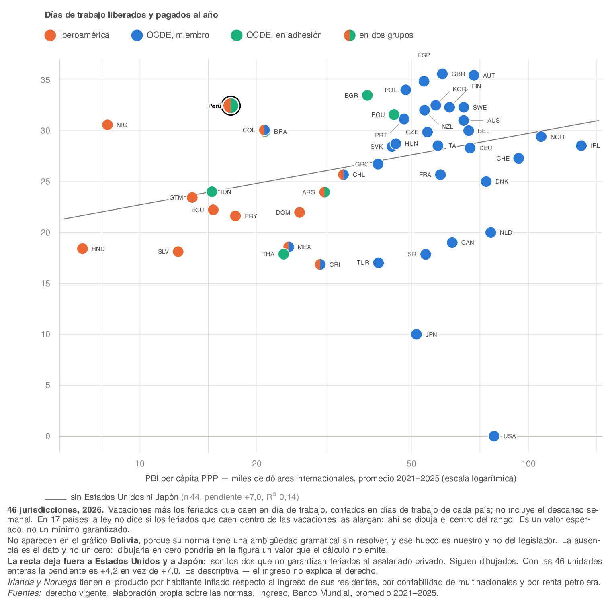

# Comparación de feriados y vacaciones de ley en Perú, Iberoamérica y la OCDE

Kristian López Vargas

## Mensajes clave

**El piso legal de descanso en Perú supera las medianas de Iberoamérica y de la
OCDE. El total, sin embargo, se compone de manera distinta frente a cada
referente.**

- **Nivel.** Los derechos legales de un trabajador de referencia en Perú
  equivalen a **32,4 días de trabajo liberados y pagados al año**
  bajo los supuestos de este estudio, el 12,5 % de su año laboral.
  **No es un piso exigible y conviene decirlo en la misma frase**: el total
  descuenta la superposición esperada entre feriados y vacaciones suponiendo que
  el descanso se coloca uniformemente en el año, así que es un valor esperado del
  modelo y no una cantidad que la ley obligue a conceder. Las dos partes que lo
  componen sí son derechos escritos. La mediana de Iberoamérica es
  22,8 días y la de la OCDE 28,5.

- **Composición.** La diferencia no viene del mismo derecho en los dos casos.
  Frente a la OCDE, el derecho peruano a vacaciones es equivalente
  —4,29 semanas contra 4,00— y la distancia la
  ponen los feriados: 12 efectivos esperados frente a una
  mediana de 8. Frente a Iberoamérica ocurre lo
  contrario. Feriados y vacaciones son instrumentos distintos y no son
  intercambiables.

- **Por qué estas cifras difieren de las conocidas.** Los índices comparativos
  disponibles no conservan de manera uniforme la unidad en que cada ley cuenta
  los días, y por eso no permiten responder directamente esta comparación —en
  particular para normas escritas en días calendario, como la peruana.

- **Implicación.** Antes de discutir si el piso legal debe subir o bajar, el
  diagnóstico tiene que separar los dos derechos y complementarse con evidencia
  de cumplimiento y de uso efectivo, que este trabajo no mide.

*Alcance de estas cifras: describen el **derecho que concede la ley** a un trabajador
de referencia —doce meses de servicio continuo, sector privado formal—; no miden
uso efectivo, cumplimiento, bienestar ni productividad. Cada observación es una
**jurisdicción de referencia, no un promedio nacional**.*

*Palabras clave:* feriados públicos · vacaciones anuales · descanso garantizado por
ley · comparación internacional · Perú · Iberoamérica · OCDE. *Códigos JEL:* J81 ·
J88 · K31 · C81.

**Para quien investiga.** Este conjunto de datos **no sustituye** a las series
comparativas existentes y no pretende hacerlo: son anuales, cubren medio siglo y
esto son dos cortes. Lo que aporta es distinto y complementario — una recodificación
jurídica reciente que conserva, por celda, la **unidad de conteo legal**, la escala
de antigüedad, la regla de colocación, la frontera entre ambos derechos y la
procedencia hasta la norma. Sirve para **auditar y corregir** las series existentes
donde su agregación pierde información, y para extender la observación al corte
actual. Quien necesite un panel largo debe seguir usando aquéllas; quien necesite
saber de qué tipo de día se está hablando, no puede.

---

## Resumen ejecutivo

### Qué encontramos

Medimos, leyendo las normas, el descanso que la ley garantiza en
47 jurisdicciones de Iberoamérica, la OCDE y los países en adhesión,
con dos derechos en el mismo diseño: feriados públicos pagados y vacaciones
anuales mínimas.

Hay dos cortes temporales, 2016 y 2026, y su solidez es distinta en cada derecho.
En feriados el corte de 2016 está verificado contra fuente en 26 unidades y en parte en 11. En
vacaciones **está confirmado en 41 de las
45 unidades con derecho registrado**, y quedan
0 supuestas. La diferencia es la que ordena todo este trabajo:
«se buscó y se confirmó que no cambió» no es lo mismo que «no se halló norma
modificatoria», y esa distinción está en el dato, celda por celda.

La medida es el **día de trabajo liberado y pagado**: un día que el trabajador de
referencia habría trabajado y no trabaja, cobrando. Un feriado que cae en su
descanso semanal no libera nada y no cuenta.

Perú queda por encima de las dos medianas de referencia. Su composición, en
cambio, es atípica: el derecho a vacaciones está en línea con la OCDE y el número
de feriados que efectivamente liberan un día de trabajo es alto.

### Por qué importa

La discusión pública sobre días de descanso suele apoyarse en el número de
feriados del calendario o en índices comparativos de regulación laboral. Ninguna
de las dos cosas responde la pregunta relevante para política, y hay literatura
que permite decir por qué con precisión.

**Lo que se sabe del coste.** La estimación más limpia disponible explota una
fuente de variación elegante: cuando un feriado cae en fin de semana y la norma no
lo sustituye, el país gana un día hábil de forma cuasi-aleatoria, sin que la ley
cambie.

El trabajo que explota esa variación —Rosso y Wagner, sobre unos doscientos
países— encuentra que **el coste de un feriado adicional es sustancialmente menor
que el del cálculo ingenuo** —dividir el
producto entre los días laborables del año—, porque parte de la actividad se
desplaza a otros días y porque hostelería y turismo aumentan su facturación
justamente ese día. El efecto se concentra en manufactura y no aparece en minería
ni agricultura. El mismo trabajo reporta menos accidentes laborales y un aumento
de la felicidad declarada de corto plazo en los años con más feriados
transitorios.

*Este reporte no reproduce las magnitudes puntuales de ese trabajo, y la omisión
es deliberada. Su repositorio no es accesible, las cifras que circulan provienen
de fuentes secundarias, y la propia revisión bibliográfica de este proyecto marcó
esa referencia como pendiente de captura primaria antes de citarse. Citar una
elasticidad concreta apoyada en una cadena que no podemos cerrar sería el defecto
que este documento le reprocha a otros. El signo y el orden de magnitud son
robustos en la literatura; el número exacto se publicará cuando se capture la
fuente.*

**Lo que se sabe del efecto sobre el trabajo.** Un mandato de vacaciones no se
diluye en ajustes compensatorios: Altonji y Oldham encuentran que las horas
anuales trabajadas caen cerca de una semana completa por cada semana de vacaciones
pagadas que otorga la ley. El mismo trabajo documenta dos hechos que este proyecto
asumió por razones de constructo y que tienen así respaldo externo: las vacaciones
se determinan por política del empleador más que por negociación individual, y
están fuertemente ligadas a la antigüedad.

**Por qué la composición no es un detalle contable.** Alesina, Glaeser y Sacerdote
atribuyen el grueso de la brecha de horas trabajadas entre Estados Unidos y Europa
a la regulación laboral, y descartan las alternativas habituales —los impuestos
explican poco, y la cultura no puede explicarlo porque los europeos trabajaban más
que los estadounidenses hasta los años sesenta—. El mecanismo que proponen es un
**multiplicador social del ocio**: el retorno al tiempo libre aumenta cuando más
gente lo toma al mismo tiempo.

Ese mecanismo conecta directamente con el segundo resultado de este reporte. Si el
valor del descanso depende de cuánta gente descansa a la vez, entonces **un
feriado y un día de vacaciones no son bienes intercambiables**, aunque cuenten
igual en el total: el feriado es sincronizado por construcción y el día de
vacaciones no. Una jurisdicción que alcanza su total por feriados está comprando
un bien distinto del que compra otra que lo alcanza por vacaciones, y la
diferencia no es de grado.

**Lo que la literatura todavía no da.** No existe un marco cerrado que permita
decir cuál es el nivel óptimo de descanso legal para un país concreto. Hay
estimaciones de coste, hay evidencia de beneficios en salud y recuperación, y hay
un mecanismo de coordinación que sugiere equilibrios múltiples —lo que implica que
la comparación entre países no identifica un óptimo, porque cada uno puede estar
en un equilibrio distinto—. Este reporte no llena ese vacío: mide el piso legal y
lo hace comparable, que es la condición previa para cualquier discusión sobre
nivel.

**Y por eso el defecto de medición importa.** El calendario no distingue el feriado
que libera un día de trabajo del que cae en descanso semanal —y la propia
estrategia de identificación de la literatura citada depende de esa distinción—.
Los índices comparativos tratan las vacaciones como una cantidad de días sin
declarar **días de qué**, y las leyes no cuentan días de la misma cosa: la peruana
concede días calendario, la alemana *Werktage*, la de Ontario semanas. Sin resolver
eso, ni el coste ni el beneficio se pueden asignar al país correcto.

### Qué debería hacer distinto quien decide

**Separar los dos instrumentos en el diagnóstico.** Un mismo total puede provenir
de muchos feriados con vacaciones medianas o de lo contrario, y no son el mismo
bien: los feriados son fechas comunes a todos, las vacaciones se colocan y su
colocación se negocia.

**Declarar la unidad de conteo al citar cualquier comparación internacional**,
propia o ajena. Es la información que hace recalculable una cifra.

**Complementar con evidencia de cumplimiento y uso** antes de concluir sobre el
nivel. El piso legal es una condición necesaria y no describe lo que ocurre.

### Qué no permite concluir

Este trabajo describe derecho vigente, no práctica. **No afirmamos ser más
exactos** que los índices existentes: afirmamos ser auditables y reproducibles en
la medida que documenta el anexo de fiabilidad. No identifica efectos causales, no estima un
nivel óptimo, y no mide cumplimiento ni uso efectivo. **Ausencia no verificada no
es ausencia**: un delta de cero entre cortes puede significar que no hubo reforma
o que no se buscó.

---

# Parte I · Cuánto descanso garantiza la ley

## 1. El piso legal peruano se sitúa por encima de sus dos referentes

**Cuadro 1.** Días de trabajo liberados y pagados al año, corte 2026

| grupo | n | mediana de descanso, en días | mediana del % del año laboral | mediana de feriados efectivos |
|---|---:|---:|---:|---:|
| Perú | 1 | 32,4 | 12,5 % | 12 |
| Iberoamérica | 14 | 22,8 | 8,5 % | 9 |
| OCDE | 32 | 28,5 | 11,0 % | 8 |

*Fuente:* elaboración propia sobre 46 jurisdicciones con
medición completa. La fracción se calcula sobre el año laboral propio de cada
jurisdicción. *Nota:* donde la norma no determina si los feriados dentro del
período vacacional lo extienden, el resultado es un intervalo y no un punto: son
17 jurisdicciones.

La posición de Perú por encima de ambas medianas es estable frente a las
convenciones de cálculo disponibles. Bajo el marco común de cinco días —que
ignora la jornada real y trata a todas las jurisdicciones igual— la cifra peruana
es 32,4 días.

El cuadro siguiente da el conjunto completo, sin agregar. Se publica en el cuerpo y
no en el anexo a propósito: el lector que quiera comprobar dónde está Perú frente a
un país concreto —y no frente a una mediana— tiene que poder hacerlo sin cambiar de
documento.

**Cuadro 2.** Descanso garantizado por la ley en las 46
jurisdicciones con medición completa, corte 2026

| # | país | jurisdicción | grupo | semana | vacaciones | feriados efectivos esperados | descanso, en días | % año laboral | # por fracción |
|---:|---|---|---|---:|---:|---:|---:|---:|---:|
| 1 | Reino Unido | Londres | OCDE | 5 | 28,0 | 8,0 | 35,1–36,0 | 13,5 % | 1 |
| 2 | Austria | Viena | OCDE | 5 | 25,0 | 10,4 | 35,4 | 13,6 % | 2 |
| 3 | España | Madrid | OCDE | 5 | 21,4 | 14,0 | 34,3–35,4 | 13,2 % | 3 |
| 4 | Polonia | Varsovia | OCDE | 5 | 20,0 | 14,0 | 34,0 | 13,1 % | 4 |
| 5 | Bulgaria | Sofía | — | 5 | 20,0 | 14,0 | 32,9–34,0 | 12,7 % | 5 |
| 6 | Corea del Sur | Seúl | OCDE | 5 | 15,0 | 18,0 | 32,0–33,0 | 12,3 % | 6 |
| **7** | **Perú** | **Lima** | **Iberoamérica** | **5** | **21,4** | **12,0** | **32,4** | **12,5 %** | **7** |
| 8 | Finlandia | Helsinki | OCDE | 5 | 25,0 | 7,3 | 32,3 | 12,4 % | 8 |
| 9 | Suecia | Estocolmo | OCDE | 5 | 25,0 | 7,3 | 32,3 | 12,4 % | 9 |
| 10 | Nueva Zelanda | Auckland | OCDE | 5 | 20,0 | 12,0 | 32,0 | 12,3 % | 10 |
| 11 | Rumanía | Bucarest | — | 5 | 20,0 | 11,6 | 31,6 | 12,1 % | 11 |
| 12 | Portugal | Lisboa | OCDE | 5 | 22,0 | 9,1 | 31,1 | 12,0 % | 12 |
| 13 | Australia | Sídney | OCDE | 5 | 20,0 | 11,0 | 31,0 | 11,9 % | 13 |
| 14 | Nicaragua | Managua | Iberoamérica | 5 | 21,4 | 9,1 | 30,6 | 11,8 % | 14 |
| 15 | Colombia | Bogotá | Iberoamérica · OCDE | 5 | 12,5 | 18,0 | 29,6–30,5 | 11,4 % | 15 |
| 16 | Bélgica | Bruselas | OCDE | 5 | 20,0 | 10,0 | 30,0 | 11,5 % | 16 |
| 17 | Brasil | São Paulo | Iberoamérica | 5 | 21,4 | 8,9 | 29,6–30,3 | 11,4 % | 17 |
| 18 | República Checa | Praga | OCDE | 5 | 20,0 | 9,9 | 29,9 | 11,5 % | 18 |
| 19 | Noruega | Oslo | OCDE | 5 | 20,8 | 8,6 | 29,4 | 11,3 % | 19 |
| 20 | Hungría | Budapest | OCDE | 5 | 20,0 | 8,7 | 28,7 | 11,0 % | 20 |
| 21 | Italia | Roma | OCDE | 5 | 20,0 | 8,9 | 28,2–28,9 | 10,8 % | 21 |
| 22 | Irlanda | Dublín | OCDE | 5 | 20,0 | 8,9 | 28,2–28,9 | 10,8 % | 22 |
| 23 | Eslovaquia | Bratislava | OCDE | 5 | 20,0 | 8,4 | 28,4 | 10,9 % | 23 |
| | **mediana del conjunto** | | | | | | **28,4** | **10,9 %** | |
| 24 | Alemania | Berlín | OCDE | 5 | 20,0 | 8,3 | 28,3 | 10,9 % | 24 |
| 25 | Suiza | Zúrich | OCDE | 5 | 20,0 | 7,6 | 27,0–27,6 | 10,4 % | 25 |
| 26 | Grecia | Atenas | OCDE | 5 | 20,0 | 6,7 | 26,7 | 10,3 % | 26 |
| 27 | Chile | Santiago | Iberoamérica · OCDE | 5 | 15,0 | 11,0 | 25,4–26,0 | 9,8 % | 27 |
| 28 | Francia | París | OCDE | 5 | 25,0 | 0,7 | 25,6–25,7 | 9,9 % | 28 |
| 29 | Dinamarca | Copenhague | OCDE | 5 | 25,0 | 0,0 | 25,0 | 9,6 % | 29 |
| 30 | Indonesia | Yakarta | — | 5 | 12,0 | 12,0 | 24,0 | 9,2 % | 30 |
| 31 | Argentina | Buenos Aires | Iberoamérica | 5,5 | 11,0 | 13,2 | 23,7–24,2 | 8,3 % | 33 |
| 32 | Guatemala | Ciudad de Guatemala | Iberoamérica | 5 | 15,0 | 8,4 | 23,4 | 9,0 % | 31 |
| 33 | Ecuador | Guayaquil | Iberoamérica | 5 | 10,7 | 12,0 | 22,2 | 8,5 % | 32 |
| 34 | República Dominicana | Santo Domingo | Iberoamérica | 5,5 | 12,8 | 9,4 | 21,8–22,2 | 7,6 % | 36 |
| 35 | Paraguay | Asunción | Iberoamérica | 5 | 12,0 | 9,9 | 21,4–21,9 | 8,2 % | 34 |
| 36 | Países Bajos | Ámsterdam | OCDE | 5 | 20,0 | 0,0 | 20,0 | 7,7 % | 35 |
| 37 | Canadá | Toronto | OCDE | 5 | 10,0 | 9,0 | 19,0 | 7,3 % | 37 |
| 38 | México | Ciudad de México | Iberoamérica · OCDE | 5 | 12,0 | 6,6 | 18,6 | 7,1 % | 38 |
| 39 | Honduras | Tegucigalpa | Iberoamérica | 5 | 10,0 | 8,6 | 18,2–18,6 | 7,0 % | 39 |
| 40 | El Salvador | San Salvador | Iberoamérica | 5 | 10,7 | 7,7 | 18,1 | 7,0 % | 40 |
| 41 | Tailandia | Bangkok | — | 5 | 5,0 | 13,0 | 17,8–18,0 | 6,8 % | 41 |
| 42 | Israel | Jerusalén | OCDE | 5 | 11,4 | 6,4 | 17,9 | 6,9 % | 42 |
| 43 | Turquía | Estambul | OCDE | 5 | 11,7 | 5,4 | 17,0 | 6,5 % | 43 |
| 44 | Costa Rica | San José | Iberoamérica · OCDE | 5 | 10,0 | 7,0 | 16,7–17,0 | 6,4 % | 44 |
| 45 | Japón | Tokio | OCDE | 5 | 10,0 | 0,0 | 10,0 | 3,8 % | 45 |
| 46 | Estados Unidos | Nueva York | OCDE | 5 | 0,0 | 0,0 | 0,0 | 0,0 % | 46 |

*Fuente:* elaboración propia. Ordenado por días de trabajo liberados. La última
columna da el puesto bajo el criterio alternativo —fracción del año laboral—; que
los dos casi coincidan es propiedad del dato actual y no del método, y la sección sobre la construcción de la medida
explica los tres criterios. *Nota:* un intervalo en la columna de descanso indica
que la norma no determina si los feriados dentro del período vacacional lo
extienden.

### 1.1. Cómo leer la distribución

Tres rasgos del cuadro anterior no se ven en una mediana.

**El conjunto es continuo salvo en su extremo bajo.** No hay un grupo de
jurisdicciones generosas y otro de restrictivas con un hueco entre medias: en la
mayor parte del recorrido, la diferencia mediana entre posiciones consecutivas es
de 0,43 días, por debajo de la incertidumbre declarada de la propia
medición. La consecuencia práctica es
que **el puesto ordinal transmite menos información de la que parece**: un puñado
de puestos de distancia puede corresponder a menos de un día de trabajo al año.
Por eso este reporte usa el ordinal sólo dentro de las exhibiciones y nunca en una
afirmación.

**La excepción está abajo, y la explica la ley.** Estados Unidos y Japón quedan
separados del resto por un salto de 10,0 días, que es
23 veces la diferencia mediana del resto del ordenamiento. Los dos
pertenecen al grupo cuyo calendario de feriados no crea obligación exigible al
empleador privado; y a diferencia de Dinamarca y los Países Bajos, que están en
esa misma situación, no lo compensan con un derecho vacacional amplio. La sección
siguiente desarrolla ese caso.

**En la parte alta se concentran** jurisdicciones cuya norma de vacaciones concede
cinco semanas o más. Perú está arriba por una combinación distinta, que es el
objeto de la sección siguiente.

**La distancia de Perú a cada referente no es la misma.** Frente a la mediana
iberoamericana —22,8 días— la diferencia es amplia; frente a la de la
OCDE —28,5— es estrecha. Un mismo enunciado, «Perú está por encima de
la mediana», describe dos situaciones distintas según el grupo, y por eso el
mensaje titular nombra los dos.

### 1.2. Qué significan estas cifras en términos del trabajador

Traducir la unidad ayuda a dimensionar. Los 32,4 días de trabajo
liberados en Perú suman ambos derechos: las vacaciones que la ley obliga a conceder
y los feriados que efectivamente liberan una jornada. Expresado como fracción del
tiempo que el trabajador de referencia habría dedicado a trabajar, es el
12,5 % de su año laboral.

Esa cifra no dice lo siguiente. No dice cuántos días descansa un
trabajador peruano: dice cuántos puede exigir. La distancia entre una cosa y otra
—cumplimiento, informalidad, uso efectivo del derecho a vacaciones— es
sustancial en cualquier país y este trabajo no la mide. En una economía con alta
informalidad, además, el piso legal describe la situación de una fracción de la
población ocupada, no del conjunto.

### 1.3. El nivel no se explica por el ingreso del país

Un lector que ve a Perú por encima de las dos medianas hace enseguida la pregunta
obvia: si el descanso de ley creciera con la riqueza, la posición peruana no diría
nada sobre su legislación y sí sobre su nivel de renta. La pregunta tiene
respuesta con estos datos.

**Figura 1.** Descanso garantizado por la ley y producto por habitante, corte 2026

Hay asociación y es débil. La recta ajustada sobre las
44 jurisdicciones que quedan al excluir a Estados Unidos y Japón —los dos que no garantizan ningún feriado al asalariado privado— sube
7,0 días por cada multiplicación por diez del ingreso, con un
coeficiente de determinación de 0,14. **Esa exclusión no es inocua y por
eso va dicha aquí:** los dos excluidos son de los que menos descanso garantizan,
y sin excluirlos la pendiente es 4,2. La asociación que
esta figura muestra es la más fuerte de las que caben en estos datos, no la
única.

**La magnitud es lo que importa, y se lee sin estadística.** A lo largo de todo el
rango de ingreso del conjunto —de un extremo al otro, un factor de más de
diez— la recta describe un recorrido de 9,0 días. La distancia
que separa a la jurisdicción más generosa de la menos generosa es de
35,6 días. El ingreso acompaña una parte de la variación y deja
fuera la mayor.

**Y Perú está 8,1 días por encima de lo que su nivel de ingreso
predice** — una distancia casi tan grande como todo el recorrido que la recta
describe de punta a punta. Su posición no es un subproducto de su renta.

**Y la asociación no sólo es débil: su signo depende de cómo se pese.**
Ponderando cada jurisdicción por su población, la pendiente pasa de
4,2 a −15,6 días y cambia de
dirección. El cambio lo produce una sola observación: Estados Unidos, cuya
población es el 16 % del conjunto y cuyo descanso garantizado por
la ley es cero. Esa pendiente es una medición correcta y descansa en un punto, y
las dos cosas hay que decirlas juntas. La recta que este reporte publica es la que
no depende de ninguna observación concreta.

Tres advertencias sobre cómo leer esta figura, y las tres acotan hacia el mismo
lado.

**La recta es descriptiva y no estima ningún efecto.** Aquí no hay muestra: el
conjunto es la población entera del grupo de referencia, de modo que una recta
ajustada no tiene siquiera la excusa inferencial. Describe una forma; no
identifica una relación.

**El producto por habitante es contexto y no explicación.** Este trabajo no mide
por qué una legislatura concede los días que concede, y nada de lo anterior debe
leerse como que el ingreso los determine ni deje de determinarlos.

**Irlanda y Noruega tienen el producto por habitante inflado** respecto al
ingreso de sus residentes: la primera por contabilidad de multinacionales, la
segunda por renta petrolera. Las dos van declaradas en el pie de la figura.

## 2. Un total parecido puede provenir de derechos muy distintos

**Cuadro 3.** Descomposición del total en vacaciones y feriados efectivos
esperados, corte 2026

| componente | Perú | mediana OCDE | mediana Iberoamérica |
|---|---:|---:|---:|
| Vacaciones, en semanas de trabajo | 4,29 | 4,00 | 2,40 |
| Feriados efectivos, en semanas | 2,40 | 1,70 | 1,80 |
| Feriados perdidos en el descanso semanal, en semanas | 0,80 | 0,29 | 0,54 |

*Fuente:* elaboración propia. **La cifra de feriados es una esperanza, no un
recuento**, y por eso puede ser fraccionaria: un feriado de fecha fija que la ley
no rescata cuando cae en fin de semana libera un día en cinco de cada siete años,
y entra ponderado por esa probabilidad en vez de por el año concreto del corte.
Los feriados que la ley rescata, y los anclados en Pascua, entran como enteros
porque su día de la semana es determinista.

Frente a la OCDE, el derecho peruano a vacaciones es equivalente
—4,29 semanas contra 4,00— y toda la distancia la
ponen los feriados. Frente a Iberoamérica la relación se invierte: la mediana
regional de vacaciones es 2,40 semanas, muy por debajo de la
peruana, y ahí el derecho vacacional explica la mayor parte de la diferencia.

Que la misma posición se alcance por caminos distintos no es una curiosidad
estadística. Tiene tres consecuencias para quien diseña política.

### 2.1. En algunas jurisdicciones el calendario de feriados no crea ningún derecho

El caso extremo de la distinción anterior se enuncia con nombres porque explica
posiciones del ordenamiento que de otro modo parecen errores.

En 4 jurisdicciones del conjunto —**Estados
Unidos, Japón, Dinamarca y los Países Bajos**— el calendario de feriados públicos
**no genera ninguna obligación exigible al empleador privado**. Los días existen,
están en el calendario oficial y en varios casos cierran la administración pública,
pero la ley no obliga a la empresa privada a conceder descanso pagado por ellos: lo
que exista en el sector privado surge del convenio colectivo o del contrato, no de
la norma.

Otras 2 están a medio camino: **Francia declara once feriados y
sólo uno es exigible**, el primero de mayo. No es que le falte calendario; es que
el resto de sus días no crean un derecho individual frente al empleador. **Costa
Rica** es el otro caso, con una minoría de sus días fuera del régimen obligatorio.

Sumado el conjunto, 58 de los
569,5 días de feriado declarados en las
47 jurisdicciones **no tienen respaldo exigible**. Esa proporción es la
medida directa de cuánto engaña contar calendarios.

Dos consecuencias.

**La primera es de lectura.** Cualquier comparación que cuente días de calendario
sitúa a esas jurisdicciones en la mitad alta y a Perú por debajo de varias de
ellas. Contando derecho exigible, la relación se invierte. No es un matiz técnico:
es la diferencia entre comparar calendarios y comparar derechos, y sólo una de las
dos cosas describe lo que un trabajador puede reclamar.

**La segunda es sustantiva y acota el alcance de este trabajo.** Que el derecho
legal sea nulo no significa que el descanso lo sea — en esos países la cobertura
efectiva por convenio o por costumbre puede ser alta, y este trabajo no la mide.
Lo que la comparación muestra es dónde el descanso está garantizado **por la ley**
frente a dónde depende de la negociación. Para una discusión de política peruana
esa distinción es exactamente la relevante, porque es la que el legislador puede
mover.

**Los dos derechos se asignan de forma distinta.** Un feriado es una fecha fija que
coincide para toda la población ocupada: **no hay que pedirlo ni negociarlo**. Las
vacaciones, en cambio, se colocan, y su colocación se negocia. Un derecho de igual
tamaño puede rendir descansos muy desiguales según quién decida cuándo se toma, y
la evidencia de este mismo proyecto sobre reglas de colocación muestra que en buena
parte de las jurisdicciones el desacuerdo lo resuelve el empleador. Cuánto de esa
diferencia de diseño se traduce en diferencia de disfrute efectivo es una pregunta
de cumplimiento, que este trabajo no mide.

**Producen efectos económicos distintos.** El feriado es sincronizado: concentra
consumo, desplazamientos y demanda de servicios en fechas conocidas, y su coste
para el empleador se concentra igual. Las vacaciones se reparten a lo largo del
año. Un mismo total puede corresponder a perfiles muy distintos de
estacionalidad, y una reforma que mueva el total por un canal o por el otro no
produce el mismo efecto.

**Se reforman por vías distintas.** Añadir un feriado es un acto legislativo
puntual, de bajo coste político y efecto inmediato; modificar el régimen
vacacional toca el contrato de trabajo y suele exigir negociación. Es razonable
esperar que eso sesgue la política observada hacia el instrumento barato.

**Los datos de este trabajo son compatibles con esa hipótesis, y la comparación
ya se sostiene.** Entre las unidades con los dos cortes capturados, el conteo de
feriados se movió en 21 de 45; el derecho
vacacional, en 4 de 45. Los denominadores no son
47 y hay que decirlo: 2 unidades no
tienen capturado el corte de 2016 de feriados, y para ellas el panel muestra un salto desde cero que **es una
ausencia y no un cambio**. Contarlo inventaría una reforma que nadie midió.

Durante buena parte de este trabajo esa comparación no era utilizable, y conviene
decir por qué ya lo es. Un delta de cero en vacaciones podía significar que no
hubo reforma o que no se había buscado, y mientras el corte antiguo fuera
mayoritariamente supuesto, su quietud medía el estado del registro y no el de la
legislación. Hoy el corte de 2016 tiene 41 celdas con el
no-cambio **buscado y confirmado** contra índice oficial o instrumento
localizado, 4 con su reforma capturada y fechada, y
0 supuestas. La quietud del derecho vacacional es un hallazgo
sobre la legislación, no una sombra de nuestra búsqueda.

**Lo que el dato no dice es el porqué**, y ahí la abstención sigue en pie: que un
instrumento se use más que otro es consistente con el argumento del coste político
y también con al menos otras dos que este diseño no separa. Una: el derecho
vacacional podría estar cerca de un techo de convergencia internacional, de modo
que la quietud sería saturación y no coste. Otra: la vía efectiva de aumento
podría ser la negociación colectiva y no la ley, y entonces la ley se quedaría
quieta mientras el descanso efectivo se mueve fuera de nuestra medida — lo que es
consistente con que el registro de reformas recoja cambios en las reglas de
disfrute y ninguno en la cantidad. **Se publica la asimetría, no su causa**, y se
nombran las alternativas para que se pueda discutir con nosotros.

Para el caso peruano, la lectura es que **su posición alta frente a la OCDE
descansa en el instrumento sincronizado y no en el individual**. Cualquier
discusión sobre el nivel del piso legal debería empezar por decidir de cuál de los
dos se está hablando.

## 3. El cambio en la década es desigual, y su procedencia hay que leerla

Antes del cuadro, una distinción que gobierna toda esta sección y que el dato
distingue explícitamente. Un valor de 2016 puede estar **verificado** contra la
norma vigente entonces, o registrado como **supuesto**, que significa «no se halló
norma modificatoria entre los dos cortes». No son lo mismo, y confundirlos es el
error que este proyecto se propuso corregir en el material del que partió.

El reparto es asimétrico entre los dos derechos y conviene saberlo antes de leer
cualquier delta. En **feriados**, el corte de 2016 se capturó contra fuente en la
mayoría de las jurisdicciones. En **vacaciones** hubo una campaña de verificación
dedicada, y su resultado es que 41 unidades tienen el
no-cambio confirmado contra índice oficial de modificaciones del artículo o contra
instrumento localizado y fechado, y 0 siguen supuestas. Las
jurisdicciones con reforma vacacional capturada del período son
4, y son también las únicas con dos versiones registradas de su
norma; entre ellas la mexicana, cuyo derecho del primer año pasó de seis a doce
días hábiles con efecto en enero de 2023 por decreto publicado en diciembre de
2022, y la israelí, que elevó el derecho con efecto en enero de 2017.

De ahí se seguía una regla de lectura que hoy sólo se aplica a las supuestas: **un
delta de cero sin verificar no es evidencia de estabilidad legislativa.** Es la
ausencia de una búsqueda positiva de
modificatorias, y se declara como tal.

**Cuadro 4.** Cambio en el conteo de feriados entre 2016 y 2026

| país | jurisdicción | corte 2016 | corte 2026 | cambio | de ellos, exigibles en 2026 | procedencia del corte 2016 |
|---|---|---:|---:|---:|---:|---|
| Corea del Sur | Seúl | 1 | 18 | +17 | 18 | verificado |
| Grecia | Atenas | 4 | 9 | +5 | 9 | verificado en parte |
| Rumanía | Bucarest | 12 | 17 | +5 | 17 | verificado en parte |
| Perú | Lima | 12 | 16 | +4 | 16 | verificado |
| Portugal | Lisboa | 9 | 13 | +4 | 13 | verificado |
| Ecuador | Guayaquil | 10 | 12 | +2 | 12 | verificado |
| Argentina | Buenos Aires | 15 | 16 | +1 | 16 | verificado |
| Brasil | São Paulo | 11 | 12 | +1 | 12 | verificado |
| Chile | Santiago | 15 | 16 | +1 | 16 | verificado |
| Alemania | Berlín | 9 | 10 | +1 | 10 | verificado |
| Hungría | Budapest | 10 | 11 | +1 | 11 | verificado en parte |
| Irlanda | Dublín | 9 | 10 | +1 | 10 | verificado |
| Nicaragua | Managua | 11 | 12 | +1 | 12 | verificado |
| Nueva Zelanda | Auckland | 11 | 12 | +1 | 12 | verificado en parte |
| Polonia | Varsovia | 13 | 14 | +1 | 14 | verificado |
| Paraguay | Asunción | 12 | 13 | +1 | 13 | verificado |
| Turquía | Estambul | 6 | 8 | +1 | 8 | verificado |
| Estados Unidos | Nueva York | 10 | 11 | +1 | 0 | verificado |
| Austria | Viena | 14 | 13 | -1 | 13 | verificado |
| Dinamarca | Copenhague | 11 | 10 | -1 | 0 | verificado |
| Eslovaquia | Bratislava | 15 | 11 | -4 | 11 | verificado |

*Fuente:* elaboración propia sobre los dos cortes. *Nota:* el cambio observado
incluye medidas temporales vigentes en el año del corte; véase el aviso sobre
Eslovaquia inmediatamente debajo.

**Una medida temporal puede leerse como una reforma permanente, y en este cuadro
ocurre.** Eslovaquia registra una caída de
4 feriados entre los dos cortes, y las dos cifras son
correctas. Pero la caída **permanente** es de 2: los
2 días restantes están suspendidos por una
disposición transitoria que vence al cierre del año del corte y los restituye al
siguiente. El corte de este estudio cae justamente en el único año en que la
suspensión está activa.

El caso excede a Eslovaquia porque **el defecto es del diseño de
dos cortes y no de la captura**. Una medición en dos momentos no distingue por sí
sola una reforma de una medida transitoria que casualmente esté vigente en la fecha
elegida; ambas se ven igual. Y una fuente que publique un escalar por año tampoco
puede distinguirlas, porque la diferencia no está en el valor sino en el fundamento
jurídico que lo produce.

Lo que este conjunto de datos añade es precisamente ese fundamento: registra si un
cambio es permanente o temporal, con la norma que lo dispone y la fecha en que
vence, de modo que el aviso viaja pegado a la cifra en el apéndice de la unidad
afectada. Quien use ese delta para una comparación entre países debe usar el permanente; quien estudie el calendario efectivo del año en curso, el
observado. **La cifra correcta depende de la pregunta, y por eso se publican las
dos con su fundamento.**

La procedencia de este cuadro es más débil que la del resto del documento, y por eso
la salvedad va junto a la cifra y no en el anexo. **La última columna dice, unidad
por unidad, de dónde sale el corte de 2016**, y conviene leerla antes que el
cambio: un mismo delta pesa distinto según se haya leído la norma de 2016 o se
haya supuesto que no cambió.

Y hay que mirar también lo que el cuadro **no** muestra. Sólo aparecen aquí las
unidades cuyo conteo se movió; las 26 restantes no tienen fila, y su
ausencia agrupa cosas distintas: 9 con el corte de 2016
verificado, 7 verificadas en parte,
8 supuestas sin cambio y 2 sin capturar. Sólo
las primeras autorizan a leer el cero como **ausencia verificada de reforma**; en
las supuestas, el cero significa que no se buscó. No tienen capturado el corte de 2016 2 jurisdicciones,
porque su calendario se fija por decreto cada año.

## 4. Cómo se construye una de estas cifras: el caso peruano paso a paso

Esta sección reconstruye la cifra de Perú desde el texto legal hasta el número
publicado, como ilustración del procedimiento. Cualquier otra jurisdicción
se deriva con los mismos pasos, y el apéndice de verificación de cada unidad los
recorre celda por celda.

### 4.1. De dónde sale el derecho a vacaciones

La norma peruana concede **30 días** de descanso vacacional. El primer
paso, y el que más error introduce si se salta, es preguntar **días de qué**: el
«Decreto Legislativo 713», que consolida la legislación sobre descansos
remunerados, los cuenta en **días calendario** y no en días laborables. Treinta
días corridos incluyen los domingos.

Convertirlos a una magnitud comparable no exige suponer nada sobre la jornada. Un
día calendario es un séptimo de semana, se trabaje lo que se trabaje, de modo que
30 días calendario son **4,29 semanas de derecho**.
Ésa es la cifra que no depende de ninguna convención.

Expresarla en días de trabajo sí requiere fijar cuántos días tiene la semana. Sobre
el marco de cinco, 4,29 semanas son **21,4 días de
trabajo**. Es una multiplicación, no un supuesto adicional: cambia el rótulo, no el
derecho.

Aquí es donde la comparación estándar se rompe. El índice comparativo más usado
registra para Perú los 30 días sin convertirlos, y para Alemania
convierte de *Werktage* a semana de cinco. Los dos números acaban en la misma
columna significando cosas distintas.

### 4.2. De dónde sale el número de feriados

El calendario peruano declara más feriados de los que efectivamente liberan un día
de trabajo, y la diferencia importa. Dos filtros se aplican en orden.

**Primero, el régimen.** Sólo cuentan los feriados que la ley declara de descanso
pagado obligatorio. Los de observancia optativa, o los que no tienen mandato
nacional, quedan fuera —no porque valgan menos, sino porque no son un derecho
exigible por el trabajador de referencia.

**Segundo, el día en que caen.** Un feriado que cae en el descanso semanal no
libera ninguna jornada. En el corte de 2026, **12 feriados
efectivos esperados** liberan un día de trabajo en Perú, frente a una mediana de
8 en el conjunto.

La palabra **esperados** no es adorno. Un feriado de fecha fija que la ley no
rescata cuando cae en fin de semana libera un día en cinco de cada siete años, y
entra ponderado por esa probabilidad en lugar de por el azar del año concreto. La
alternativa —contar el año 2026 tal como cayó— haría que la cifra de una
jurisdicción se moviera año a año por rotación del calendario y no por reforma, que
es exactamente lo que este trabajo quiere poder distinguir. Los feriados anclados
en Pascua entran como enteros: la Pascua es siempre domingo, así que el Viernes
Santo es viernes todos los años.

### 4.3. Por qué el total no es la suma

Sumar los dos derechos exige resolver qué ocurre cuando un feriado cae **dentro**
del período vacacional. Hay dos regímenes posibles y la norma de cada jurisdicción
elige uno: o el feriado **extiende** las vacaciones —y entonces los dos derechos se
suman— o **se computa contra** ellas, y entonces el trabajador no gana ese día por partida doble.

Perú pertenece al segundo régimen. Por eso su total, **32,4 días de
trabajo liberados**, es menor que la suma de 21,4 y
12: se descuenta la superposición entre ambos derechos.

Ese descuento **es una esperanza y no un derecho leído de la norma**, y la
distinción importa porque cambia lo que la cifra significa. La ley no dice cuántos
feriados caerán dentro de las vacaciones de un trabajador: depende de cuándo las
tome. El descuento se obtiene suponiendo que el inicio del período vacacional se
distribuye uniformemente a lo largo del año, que es un supuesto nuestro y no una
lectura del texto legal. En consecuencia, **el total publicado no es un mínimo
exigible sino un valor esperado bajo esa distribución**: el mínimo que la ley
garantiza con certeza es algo menor, y el máximo alcanzable, algo mayor.

Y el supuesto de uniformidad tiene una dirección conocida. Las vacaciones no se
reparten de manera pareja: se concentran en verano y alrededor de las fiestas de
fin de año, que es donde también se acumulan los feriados. Si esa concentración es
real —y hay poca duda de que lo sea—, la superposición efectiva es **mayor** que la
que este cálculo descuenta, de modo que el total publicado **sobreestima** el
descanso en las jurisdicciones que computan los feriados contra el período
vacacional. No se corrige porque corregirlo exigiría datos de colocación efectiva
que este trabajo no tiene; se declara porque el sesgo tiene signo y conviene saber
cuál.

Es una decisión de constructo con consecuencias, y por eso se declara: dos
jurisdicciones con idénticos derechos nominales pueden diferir en más de un día
sólo por este régimen.

### 4.4. La cifra adimensional

32,4 días liberados sobre el año laboral peruano son el
**12,5 %**. Esta es la cifra que conviene citar en una comparación,
porque un día liberado de quien trabaja seis días a la semana no es la misma
fracción de su tiempo que el de quien trabaja cinco.

### 4.5. Cuánto de esto depende de nuestras convenciones

Tres, y las tres se pueden mover para ver qué pasa.

**La semana.** Ninguna norma del grupo declara cuántos días compone la semana
ordinaria, y la peruana no es excepción: fija topes de horas, y de ahí seis es el
máximo tolerado, no un reparto impuesto. Bajo el **marco común de cinco días**, que
trata a todas las jurisdicciones igual, la cifra peruana es
**32,4 días** en lugar de 32,4.

**El criterio de ordenamiento.** Perú es el 7 por días
liberados, el 7 por fracción del año laboral y el
7 bajo el marco común, sobre 46
jurisdicciones.

**La ponderación de los feriados.** Con conteo realizado en vez de esperado la
cifra cambia según el año del corte; el protocolo documenta por qué se eligió la
esperanza.

Ninguna de las tres mueve la afirmación de la primera plana: bajo las tres, Perú
queda por encima de la mediana de Iberoamérica y de la de la OCDE. Ése es el
motivo por el que el mensaje titular se expresa contra las medianas y no con un
puesto.

### 4.6. Qué habría que consultar para verificarlo

El apéndice de verificación de Perú recorre cada una de estas celdas con la regla
del protocolo que se le aplicó y, donde la captura lo registró, el pasaje textual
de la norma. El apéndice de país lista las fuentes con su nivel. Ambos viajan en
el paquete de datos.

# Parte II · Cómo se midió, y por qué hubo que medirlo de nuevo

## 5. Contra quiénes se compara Perú, y por qué

Un resultado comparativo depende tanto del grupo de comparación como de la
medición. Esta sección describe el grupo y defiende su composición; el universo
está congelado desde antes de recolectar el primer dato, de modo que ninguna
unidad entró o salió en función de lo que se encontró en ella.

### 5.1. La regla

El grupo es la **unión de tres componentes**, y un país entra si cumple al menos
uno:

- **Iberoamérica** — país americano de lengua ibérica.
- **OCDE** — miembro pleno.
- **Adhesión** — proceso de adhesión a la OCDE abierto a la fecha de corte.

Sobre esa unión se aplica un **piso de población de cinco millones de habitantes**
y una lista de **exclusiones sustantivas** que se resuelven antes que los
componentes. El total es de 47 unidades, Perú incluido.

### 5.2. Por qué estos tres componentes, y no otro recorte

**Iberoamérica es el grupo con el que la comparación es interpretable.** Comparte
tradición jurídica —derecho civil codificado—, un origen común en la legislación
laboral del siglo veinte, y estructuras de informalidad del mismo orden. Cuando un
responsable peruano se pregunta si el país está corto o largo, ésta es la
comparación que hace, y es la que el debate público reproduce.

**La OCDE es el patrón contra el que Perú está siendo evaluado institucionalmente.**
No se incluye como aspiración retórica: Perú tiene un proceso de adhesión abierto,
lo que convierte al conjunto de miembros plenos en un referente con consecuencias
concretas sobre revisión de políticas. Además aporta la variación que Iberoamérica
no tiene: regímenes de jornada distintos, tradiciones de negociación colectiva
distintas, y normas escritas en unidades de conteo que en la región no aparecen
—los *Werktage* germánicos, las semanas anglosajonas—, que es precisamente lo que
permite detectar el problema de unidad que documenta la sección de método.

**Los países en adhesión son los pares de trayectoria.** Comparten con Perú la
situación de estar midiéndose contra un estándar al que aún no pertenecen, y
aportan casos institucionalmente lejanos —Indonesia, Tailandia— sin salir del
criterio.

**Qué se descartó y por qué.** Comparar contra el mundo entero habría diluido el
resultado en heterogeneidad no interpretable: el piso legal de descanso sólo
significa algo donde hay un aparato de cumplimiento que lo haga exigible.
Comparar sólo contra América Latina habría dado un resultado provinciano y sin el
contraste de unidades de conteo. La unión de los tres es la respuesta a las dos
preguntas que un lector se hace —«¿cómo estamos entre pares?» y «¿cómo estamos
frente al estándar?»— sin tener que elegir una.

### 5.3. El piso de población, y lo que cuesta

El piso deja fuera a Panamá, Uruguay, Croacia, Lituania, Eslovenia, Letonia,
Estonia, Luxemburgo e Islandia.

Se sostiene en dos razones. La primera es de comparabilidad: por debajo de ese
umbral, el mercado laboral y el proceso legislativo difieren en tipo, no en grado
—un país pequeño puede reformar su calendario de feriados con un coste político
que en uno grande sería inviable—. La segunda es de estabilidad: en economías muy
pequeñas y muy abiertas, las cifras agregadas son volátiles y una unidad puede
mover una mediana.

**Y hay que decir lo que el piso cuesta, porque no es gratis:** deja fuera a
Uruguay, que es un comparador natural para Perú por región, tradición jurídica y
nivel de formalización. Un lector que quiera esa comparación no la encontrará
aquí, y la regla —no la conveniencia— es la razón. La alternativa, bajar el
umbral, habría metido microestados cuyas cifras son de otra naturaleza.

### 5.4. Las exclusiones sustantivas, y por qué son mecánicas

Quedan fuera, antes de aplicar los componentes: Cuba, Venezuela, Irán,
Irak, Ucrania, Myanmar y Rusia.

Lo que hace defendible esta lista no es su contenido sino **su disparador**: cada
exclusión se sostiene en una fuente externa citable y no en juicio propio. Cuba y
Venezuela quedan fuera por estar fuera del sistema estadístico internacional
—Cuba no es miembro del Fondo Monetario Internacional ni del Banco Mundial;
Venezuela está bajo declaración de censura del Fondo por incumplir la provisión de
datos—. Los otros cinco, por conflicto armado estatal registrado en el proyecto de
datos sobre conflictos de Uppsala.

La razón sustantiva es la misma en todos: en esos casos **sólo es observable el
derecho estatutario y no su realización**. Los textos legales existen y son
públicos, de modo que una medición de derecho vigente los podría incluir sin
dificultad técnica; incluirlos habría producido cifras formalmente correctas y
sustantivamente vacías.

Que el criterio sea mecánico importa por una razón concreta: **impide que la
composición del grupo dependa de lo que convenga al resultado.** Un lector puede
recomputar la lista de exclusiones con las fuentes citadas y obtener la misma.

### 5.5. La unión no es una partición

Los tres componentes se solapan y conviene tenerlo presente al leer los agregados
por grupo. Chile, Colombia, Costa Rica y México pertenecen a la vez a Iberoamérica
y a la OCDE; Argentina, Brasil y el propio Perú, a Iberoamérica y a adhesión. La
intersección entre OCDE y adhesión está vacía por construcción, porque la
membresía plena y el proceso abierto son excluyentes.

En consecuencia, **las medianas por grupo de este documento no son medianas de
subconjuntos disjuntos**, y sumar las cuentas de los tres componentes excede el
total. Las exhibiciones etiquetan cada unidad con todos los grupos a los que
pertenece, en lugar de asignarla a uno.

### 5.6. El trabajador de referencia

El trabajador de referencia es el mismo en todas las jurisdicciones: doce meses
exactos de servicio continuo con el mismo empleador, sector privado formal, en la
ciudad más poblada.

Cada elección acota el alcance en una dirección determinada. **Doce meses exactos** sitúa la
medición en el primer escalón de las escalas por antigüedad, que es el más
comparable y también el menos generoso donde la ley premia la permanencia.
**Sector privado formal** excluye el empleo público, cuyos regímenes suelen ser
más favorables, y el informal, donde el derecho no es exigible. **La ciudad más
poblada** resuelve el problema federal descrito enseguida y sesga hacia jurisdicciones
urbanas, que en varios países tienen calendarios de feriados locales adicionales
que este trabajo no cuenta por no ser garantía nacional.

### 5.7. La unidad de observación es una jurisdicción, no un país

En un Estado federal sin ley nacional de feriados «el número del país» no existe:
promediar jurisdicciones fabricaría una cifra que ninguna norma concede. Las
tablas nombran el país por legibilidad y la jurisdicción como precisión; donde el
alcance sea subnacional, la nota de la exhibición lo declara.

## 6. La construcción de la medida

Los días de trabajo liberados se obtienen sumando los feriados efectivos esperados
del año del corte y el derecho a vacaciones expresado en la misma unidad. Cuatro
decisiones gobiernan esa suma y las cuatro cambian el número.

**Feriados efectivos, no nominales.** Se resuelve la fecha real de cada feriado en
el año del corte y se cuenta sólo si cae en día laborable de esa jurisdicción. Dos
excepciones, ambas declaradas y contadas en la salida del calculador: hay feriados
cuya fecha **no es resoluble** —calendarios lunares, remisión normativa, costumbre
local— que se cuentan como si liberaran, lo que sobreestima esas jurisdicciones; y
las **reglas de traslado** no están capturadas como campo salvo cuando la clase de
fecha las expresa, de modo que las jurisdicciones que trasladan aparecen perdiendo
días que en la práctica recuperan.

### 6.1. Un legislador que hace nuestra misma conversión

Esta sección defiende una convención: para comparar hay que llevar los derechos
a una unidad común, y hacerlo exige suponer una semana. La objeción natural es que
la convención sea nuestra y no del legislador.

El caso israelí ofrece evidencia externa sobre ese punto. Su reforma
del derecho vacacional está acompañada de una exposición de motivos oficial que
**realiza ella misma la conversión** de días calendario a semana de cinco días,
declarando el equivalente en días de trabajo de cada uno de los dos valores. Es una
conversión atestiguada en fuente de primer nivel y no una derivación nuestra.

No prueba que nuestra convención sea la única posible, y no se presenta así. Prueba
algo más modesto y suficiente: que **la operación que este trabajo realiza para
poder comparar es la misma que un legislador realiza para poder explicarse**. Una
convención que el propio emisor de la norma emplea al describir su efecto no es un
artificio del analista.

**La semana no la fija la ley.** La base semanal
sobre la que está escrita la norma de vacaciones no es la semana que el trabajador
trabaja: los *Werktage* austriacos están escritos sobre semana de seis mientras el
trabajador austriaco hace cinco.

Al leer los literales de las 47 jurisdicciones apareció algo que no
esperábamos: **casi ninguna norma IMPONE un reparto semanal de días.** Algunas sí
escriben un número —Ecuador dice que las jornadas «no pueden exceder de cinco en la
semana»— pero lo hacen como tope y no como asignación. Lo que las leyes fijan son
topes —tantas horas al día, tantas a la semana— y de
ahí se puede *deducir* un número de días, pero deducirlo no es leerlo. El caso
peruano lo muestra: su norma dice «ocho horas diarias **o** cuarenta y ocho
semanales», con disyuntiva, de modo que seis es el máximo que tolera y no un
reparto que imponga; una semana de cinco es igualmente lícita.

Por eso la semana empleada en el cálculo es **supuesto declarado y no dato leído**,
y así consta fila por fila. Tratar un techo legal como si fuera la jornada real
desplaza la cifra de una jurisdicción de forma apreciable, y es un error fácil de
cometer sin notarlo.

**La fracción del año laboral, además de los días.** Un día hábil de quien trabaja
seis no es el mismo bien que uno de quien trabaja cinco. La fracción es la cifra
adimensional, y es la que se cita en este reporte.

**La imputación sigue la norma al pie.** Donde los feriados dentro del período
vacacional lo extienden, se suman; donde se computan contra él, se resta la
superposición esperada; y donde la norma calla, el resultado es un intervalo y no
un punto.

### 6.2. Los tres ordenamientos y por qué se publican los tres

Con el mismo dato hay tres formas defendibles de ordenar, y no coinciden.

Por **días liberados** la pregunta es cuántos días que el trabajador habría
trabajado le libera la ley. Conviene ser preciso sobre lo que eso supone, porque es
más de lo que parece: decidir si un feriado «habría sido día de trabajo» exige un
calendario semanal, de modo que la cifra **sí depende de un supuesto de jornada**,
y no de uno solo. Por **fracción del año laboral** se divide entre los días que esa
jurisdicción trabaja al año: es adimensional, pero incorpora el supuesto de que
quien trabaja más días necesita proporcionalmente más días libres para estar igual
de descansado. Por **marco común de cinco días** se mide a todas con la misma
semana, ignorando la jornada real: es lo que hace la literatura comparada y permite
contrastar con ella.

**Las dos mitades del cálculo usan el mismo calendario, y esa coherencia es una
condición del resultado y no un detalle de implementación.** Decidir si un feriado
habría sido día de trabajo y convertir el derecho vacacional a días de trabajo son
la misma pregunta planteada por partida doble; si cada una se responde con una
semana distinta,
la suma describe a dos trabajadores y no a uno. La consecuencia es concreta y va en
una sola dirección: contar los feriados contra una semana más larga que la usada
para las vacaciones **infla** el total, y lo infla más donde más feriados hay.

Por eso la elección de semana se resuelve en un único punto del cálculo y alimenta
las dos mitades, y por eso el conjunto se publica también bajo el marco común de
cinco días, que es coherente por construcción y sirve de contraste.

Perú es el 7 por días liberados, el
7 por fracción y el 7 bajo el
marco común, sobre 46 jurisdicciones. Para Perú los tres
criterios coinciden, y en el conjunto las diferencias de puesto entre ellos son
pequeñas — el cuadro del cuerpo publica los dos ordenamientos principales lado a
lado para que el lector las vea, en vez de tener que creer esta frase. Se publican
los tres, por dos razones: porque elegir
uno en silencio esconde una elección de unidad —que es exactamente lo que este
trabajo le señala al antecedente—, y porque la coincidencia es una propiedad del
dato actual y no del método.

**Por qué el mensaje titular no lleva un puesto.** El ordenamiento es sensible a
correcciones del dato que nada tienen que ver con la ley peruana. A lo largo de un
solo día de depuración el puesto de Perú cambió una y otra vez, al corregirse la
lectura de la jornada, el tratamiento de las jurisdicciones sin feriados
obligatorios y el paso de conteo realizado a conteo esperado. Su posición **por
encima de las dos medianas** no cambió en ninguna de esas revisiones. El predicado
del titular se apoya en lo que resultó estable, y los ordinales viven en las
exhibiciones, con su corte declarado.

## 7. Datos, fuentes y cobertura

**Cuadro 5.** Cobertura del conjunto de datos

| | |
|---|---|
| Jurisdicciones de referencia | 47 |
| Feriados registrados | 577 |
| Feriados con existencia condicional | 5 |
| Jurisdicciones con titularidad de vacaciones | 45 |
| Versiones de esa titularidad (más de una donde hubo reforma) | 49 |
| Reglas de colocación | 53 |
| Fuentes citadas | 251 |
| Fuentes de gaceta oficial o portal gubernamental | 166 |
| Vínculos entre un hecho y su fuente | 1475 |
| Validaciones ejecutadas sobre la base | 37 |

*Fuente:* elaboración propia.

Cada valor sale del texto legal y cada fuente lleva un **nivel** declarado. El
nivel se declara fila por fila y **no se promedia**: la concordancia entre fuentes
secundarias no eleva una verificación. 85 de 251 fuentes
están por encima del nivel de portal gubernamental.

45 jurisdicciones tienen titularidad de vacaciones
registrada. Las 2 restantes lo están por razones
distintas, y la distinción importa. En **Estados Unidos no existe mandato legal
federal** de vacaciones pagadas: la ausencia **es el dato**, y sustituirla por un
valor imputado sería inventar un derecho que la ley no concede. En **Bolivia** la
norma tiene una ambigüedad gramatical sin resolver, de modo que el hueco es
nuestro y no del legislador; queda declarado como tal en lugar de resolverse por
conveniencia.

Hay además 81 mediciones registradas como no aplicables tras
evaluarse. También son un resultado: la condición se examinó y no se cumple, que
es distinto de no haber mirado.

## 8. Qué aporta esta medición frente a las fuentes existentes

La codificación cuantitativa de normas laborales para comparación entre países
arranca con Botero et al. (2004) y se desarrolla en el programa leximétrico
posterior. Existen hoy tres fuentes comparativas sobre descanso legal, y la
pregunta razonable es por qué hizo falta una cuarta. La respuesta no es que las
otras estén mal: es que ninguna permite responder esta pregunta, y cada una por un
motivo distinto.

**Cuadro 6.** Qué ofrece cada fuente y qué le impide responder esta comparación

| fuente | cobertura | qué ofrece | qué le impide responder esta pregunta |
|---|---|---|---|
| *CBR Labour Regulation Index* (Adams et al.) | amplia y anual, serie larga; ambos derechos | La única serie temporal larga del campo, la más usada en investigación, y con cita normativa por cambio | Normaliza con topes, de modo que el conteo se recupera multiplicando por el tope salvo en las celdas censuradas; lo que **no** se recupera nunca es **la unidad de conteo** — de qué tipo de día se trata— y ésa es la información que esta comparación necesita |
| Base TRAVAIL (Organización Internacional del Trabajo) | amplia, pero **hoy fuera de línea** | Texto normativo por país con detalle institucional, incluida la dimensión de colocación | Su sitio dejó de responder tras la migración del portal y su último vintage declarado es de más de una década atrás; **no es consultable por un lector** |
| *No-Vacation Nation* (Ray, Sanes y Schmitt) | países desarrollados | Comparación cuidadosa y explícita sobre sus límites | Un solo momento, sin Iberoamérica, y no cubre feriados y vacaciones en el mismo diseño |
| **Este trabajo** | 47 jurisdicciones, dos cortes en feriados | Ambos derechos en el mismo diseño, con la **unidad de conteo como columna** y trazabilidad hasta la norma | Ventana corta, dos momentos y no una serie; no mide práctica |

*Fuente:* elaboración propia a partir de la documentación publicada por cada
fuente.

De ahí se siguen tres consecuencias concretas.

**La unidad de conteo se conserva, así que la cifra es recalculable.** Quien
prefiera otra convención —contar en días corridos, suponer semana de seis, tratar
los feriados en fin de semana de otro modo— puede rehacer el cálculo con los datos
publicados. Un índice normalizado no permite eso: la información se pierde al
agregar.

**Guatemala y El Salvador no están en el antecedente principal.** No figuran en la base del *CBR*, de modo que para ellas no existe
contraste con la serie más usada del campo. Sí están en el material de la
Organización Internacional del Trabajo recuperado del archivo, con vintage muy
anterior. Por eso se capturaron por duplicado de forma independiente: sin antecedente
contemporáneo contra el que cruzar, la doble codificación ciega es la red
principal.

**El aporte no es cubrir un derecho que otros no cubran**, y conviene no
sobrevenderlo: el antecedente principal contiene ambos derechos en el mismo
conjunto. Lo que aquí se añade es que los dos se miden **con el mismo trabajador de
referencia, la misma regla de efectividad y la unidad de conteo declarada en
ambos**, lo que permite descomponer el total sin mezclar convenciones. Ésa es la
condición para el segundo resultado de este reporte.

### 8.1. Una fuente que dejó de existir, y qué se hizo con ella

La base TRAVAIL de la Organización Internacional del Trabajo era la referencia
institucional natural para esta pregunta: cubría más de cien países con texto
normativo y, a diferencia de los índices, conservaba la dimensión de colocación del
período vacacional. **Hoy no responde.** Su sitio dejó de estar disponible tras la
migración del portal de la Organización, y el último vintage que llegó a declarar
es de hace más de una década.

Esa desaparición no es un detalle bibliográfico. Significa que un lector que quiera
contrastar cualquier cifra comparativa de descanso legal contra la fuente
institucional de referencia **no puede hacerlo**, y que el trabajo aplicado que la
citaba se apoya en algo que ya no es verificable.

Este proyecto recuperó del archivo histórico de la web las fichas de 45 de las
jurisdicciones del grupo, con sus citas normativas, y las conserva como material
comparable. Tienen dos usos y conviene
distinguirlos: son una **fuente independiente contra la cual cruzar** nuestra
captura —con la cautela de que su vintage es anterior a nuestro corte inicial— y
son, por sí mismas, un registro de un recurso público que dejó de estarlo.

### 8.2. La comparación no se puede hacer con el antecedente porque no conserva una unidad común

El índice comparativo más usado del campo (Adams et al., 2023) normaliza las
vacaciones anuales dividiendo los días concedidos por un tope, y su documentación
de métodos (Adams, Bishop y Deakin, 2017) no especifica días de qué. Sus propias
notas de codificación muestran que el criterio no es uniforme:

<!-- citado: valores publicados por el antecedente, reproducidos como evidencia -->

**Cuadro 7.** Trato de la unidad de conteo en las notas de codificación del
antecedente

| país | lo que anota su nota de codificación | codifica | ¿convierte? |
|---|---|---|---|
| Alemania | «24 working days if 6-day week; 20 if 5-day week» | 20 | sí |
| Turquía | «14 days» | 14 | no |
| Perú | «30 days» | 30 | no |

*Fuente:* notas de codificación publicadas por Adams et al. (2023). Los valores de
este cuadro son del antecedente y se reproducen literalmente.

<!-- /citado -->

Los días turcos tienen la misma estructura legal que los alemanes —excluyen
domingos y feriados, incluyen sábado— y reciben trato opuesto. Los peruanos son
días corridos y entran sin conversión junto a los otros dos.

Sobre las 43 jurisdicciones comparables, la diferencia media contra
ese índice es la más pequeña donde la ley ya cuenta en días hábiles
(−0,5) y la mayor donde cuenta en días calendario
(−5,6). El patrón **es consistente con** un problema de unidad de
conteo; no demuestra que nuestro procedimiento esté libre de sesgo. El desarrollo
completo y la auditoría de divergencias están en la sección sobre el antecedente.

## 9. El antecedente y la auditoría de divergencias

De las 47 jurisdicciones, 8 difieren del antecedente
en el conteo de feriados. Un auditor independiente las clasificó, con instrucción
explícita de que «indeterminado» era una respuesta legítima.

**Cuadro 8.** Clasificación de las divergencias auditadas

| categoría | n |
|---|---|
| error nuestro | 0 |
| desactualización del antecedente | 3 |
| diferencia de constructo, sin error de ninguno | 3 |
| indeterminado | 2 |

*Fuente:* auditoría documento contra documento.

Las desactualizaciones se verifican contra las propias notas de codificación del
antecedente. En Bulgaria su nota cita el código laboral tal como quedó en la
consolidación de 1996; en Rumanía atribuye a 2008 dos días cuando fueron tres; en
Ecuador los considerandos de la ley reformatoria transcriben la lista anterior y
dicen expresamente qué día no constaba.

Que el auditor no encontrara errores nuestros no equivale a demostrar que no los haya.

**Cuadro 9.** Diferencia contra el antecedente según la unidad de conteo de la
norma

| unidad legal de la norma | n | diferencia media | coinciden |
|---|---|---|---|
| días hábiles | 19 | −0,5 | 12 |
| semanas | 11 | −2,0 | 8 |
| *Werktage* | 6 | −3,6 | 1 |
| días calendario | 7 | −5,6 | 1 |

*Fuente:* elaboración propia sobre las 43 jurisdicciones
comparables.

El caso Perú–Alemania fija la magnitud: el índice marca 1,00 y
0,67, lo que leído tal cual da un 49 % más para
Perú; convertidos a la unidad común, 21,4 y 20,0 días, un
7 %.

**No se republica el conjunto de datos del antecedente.** Se reproducen las
observaciones indispensables para sostener la comparación y el resto se expresa
como diferencia calculada y referencia a su conjunto.

## 10. El conjunto de datos detecta reformas conocidas

Una medición nueva tiene que demostrar que mide, y la coherencia interna no basta:
dos codificadores pueden coincidir en el mismo error. La prueba exigente es
externa — comprobar si el dato reproduce cambios legislativos documentados de
forma independiente, sin que el procedimiento supiera de ellos.

La captura se hizo país por país leyendo normas, **sin una lista de reformas
esperadas que guiara la búsqueda**: los codificadores leyeron textos legales, no
titulares. Lo que sigue es el contraste posterior contra episodios documentados de
forma independiente.

**Dinamarca.** El parlamento danés abolió el *Store Bededag* por ley de 2023, con
efecto desde 2024, para financiar gasto en defensa. Cae de lleno entre los dos cortes y su dirección es inequívoca.
El dataset registra la pérdida de un feriado entre 2016 y 2026, con el corte de
2016 en estado verificado.

**Corea del Sur.** La reforma de 2018 del artículo 55, apartado segundo, de su ley
laboral extendió
al sector privado los feriados que hasta entonces sólo obligaban a órganos
públicos. Es el mayor salto de todo el conjunto, y el dataset lo recoge: la captura
coreana documenta que al inicio de la ventana el trabajador privado tenía un solo
día festivo pagado por ley —el primero de mayo— y hoy tiene el calendario completo.
Un lector podría haber tomado ese salto por un error de captura; es una reforma.

**Rumanía.** Añade feriados a lo largo del período, y el conteo lo refleja. Es
además una de las divergencias contra el antecedente que la auditoría clasificó
como desactualización suya y no error nuestro.

**Portugal.** Recupera cuatro feriados suspendidos durante la crisis, y el dataset
registra el cambio entre cortes. El caso tiene una arista de constructo que se desarrolla más adelante.

**Y en vacaciones, dos.** La reforma mexicana de «vacaciones dignas» —el derecho del
primer año pasa de seis a doce días hábiles con efecto en enero de 2023— y la
israelí, que eleva el derecho con efecto en enero de 2017. Las dos están
capturadas contra fuente primaria y con sus dos versiones registradas, de modo que
el conjunto de datos muestra el valor anterior y el posterior en lugar de sólo el
vigente.

Cinco episodios recuperados en dos derechos, todos contra fuentes que el
procedimiento no tenía delante al capturar. Es evidencia de que el instrumento
recoge cambios legislativos reales.

### 10.1. Portugal, y por qué el ancla importa

**Portugal** suspendió cuatro feriados nacionales desde 2013 y los restituyó por
votación parlamentaria en abril de 2016. El dataset registra la recuperación entre
los dos cortes, con el corte de 2016 verificado contra fuente.

El caso importa porque **el resultado depende de una decisión de
constructo que es fácil pasar por alto**. El ancla de este estudio es la norma
vigente al primero de enero del año del corte. La restitución portuguesa fue
posterior a esa fecha, de modo que al ancla de 2016 los cuatro feriados **seguían
suspendidos** y el valor correcto es el reducido. Con un ancla de fin de año, o con
una captura que registrara sólo el año sin el día, Portugal aparecería sin cambio y
el episodio desaparecería del conjunto de datos.

No es una hipótesis: **ocurrió**. Una versión anterior del cargador registraba la
vigencia con precisión de año, Portugal salía igual en los dos cortes, y el caso
obligó a corregir el cargador para admitir fecha completa. Es la clase de decisión
que no se nota hasta que borra un hallazgo.

Aun así, el caso también delimita qué preguntas admite este diseño. Dos cortes
describen estados, no trayectorias: el episodio de suspensión duró tres años dentro
de la ventana y aquí sólo se ve por su cola. Quien quiera estudiar la suspensión
necesita una serie anual, que este diseño no entrega.

# Parte III · Qué hacer con esta evidencia

## 11. Qué significa esta evidencia, y qué exige antes de usarla

**Cuadro 10.** Usos legítimos de cada hallazgo y evidencia adicional que requieren

| hallazgo | uso legítimo | qué haría falta para ir más lejos |
|---|---|---|
| Nivel del piso legal frente a las medianas | Situar a Perú en el conjunto de referencia; descartar que el piso legal sea bajo | Datos de cumplimiento y de uso efectivo del derecho |
| Composición feriados / vacaciones | Elegir el instrumento a discutir; anticipar efectos de sincronía frente a efectos individuales | Evidencia sobre colocación efectiva y sobre negociación en la práctica |
| Diferencia con los índices existentes | Corregir el diagnóstico cuando se cita una comparación internacional | Recálculo del índice ajeno declarando su unidad, que su publicación no permite |
| Cambio entre cortes | Ninguno todavía, salvo como indicio | Estado de procedencia por celda en la exportación |

*Fuente:* elaboración propia.

Ninguna fila de este cuadro sostiene una recomendación sobre el nivel del piso
legal. La recomendación que sí sostiene la evidencia es de procedimiento: **cambiar
cómo se diagnostica antes de discutir cuánto se reforma.**

### 11.1. Qué haría distinto quien tenga que decidir

Tres consecuencias operativas, ordenadas por cuánto dependen de este trabajo y
cuánto de evidencia que aún no existe.

**Primera, y es la única que se sigue directamente del dato: dejar de citar el
número de feriados del calendario.** Es la cifra que domina la discusión pública y
sobreestima el descanso, porque cuenta días que caen en el descanso semanal. La
diferencia entre el calendario y los feriados que efectivamente liberan una jornada
no es marginal y varía entre jurisdicciones, de modo que **usar el calendario
altera también el orden entre países**, no sólo el nivel. Sustituirla por la cifra
efectiva no cuesta nada y cambia la conversación.

**Segunda: separar los dos instrumentos antes de fijar el objetivo.** Si lo que se
busca es sincronía —consumo concentrado, coordinación familiar, un efecto de
calendario— el instrumento es el feriado, y la literatura sobre el multiplicador
social del ocio sugiere que su valor sube con la simultaneidad. Si lo que se busca
es descanso individual y recuperación, el instrumento es la vacación, cuyo efecto
sobre horas trabajadas está estimado y es casi de uno a uno. **Un debate que
discuta «más días» sin decir cuál de los dos está discutiendo dos políticas
distintas bajo un mismo nombre.**

**Tercera, y ésta acota lo anterior: para Perú, el margen del piso legal puede no
ser donde está el problema.** Este trabajo muestra que el derecho que concede la ley
está por encima de las dos medianas de referencia. Eso **no** implica que el descanso
efectivo lo esté: el piso legal describe lo que un trabajador puede exigir, no lo
que obtiene, y en una economía con alta informalidad la fracción de la población
ocupada a la que ese piso alcanza es una pregunta abierta que este dataset no
responde. La consecuencia práctica es concreta: **antes de mover el piso conviene
saber si la restricción que ata es la norma o su cumplimiento**, porque las dos
tienen instrumentos distintos y sólo una de ellas se arregla legislando.

Ninguna de las tres recomienda subir ni bajar el nivel. Ese juicio requiere un
marco de óptimo que, como documenta la sección sobre la literatura, no existe
todavía para este problema.

---

# Anexos

## Anexo A. Cómo se produjo esta medición, y qué acredita el registro

Sobre una muestra estratificada de unidades del conjunto se ejecutó una **doble
codificación**: una segunda captura de las mismas normas, para medir el acuerdo
entre lecturas. La muestra se eligió de modo que cada unidad estresara una parte
distinta del constructo.

El procedimiento exige que esa segunda lectura se haga sin ver la primera y por
una mano distinta. **El registro lo acredita en parte de los pares y no en todos**,
y la reserva se desarrolla al cierre de este anexo. Se dice aquí, junto al
enunciado, porque un procedimiento descrito sin su reserva se lee como
comprobado.

**Sus resultados no se publican y se conservan en la documentación interna del
proyecto.** Se excluyen enteros —tasas, segundas lecturas y programa de cruce— y
la razón está en `EXCLUSIONES.md`.

**Esta mención no debe leerse como afirmación de concordancia.** Un ejercicio de
fiabilidad citado sin su cifra es constancia de que el procedimiento se ejecutó, y
nada más: no dice que el acuerdo fuera alto ni bajo. Lo que sí se puede decir aquí
es lo que el ejercicio mide y lo que no — **reproducibilidad, no corrección**: dos
lectores pueden coincidir en el mismo error, y coincidir no hace verdadero un
valor. Y describe la muestra, no el conjunto: **no se extrapola** a las
47 unidades nada de lo que ese ejercicio encontró.

Lo que sí viaja en este paquete es la procedencia celda por celda, que es la
comprobación que un lector externo puede hacer sin creernos nada: el apéndice de
verificación recorre cada número con su pasaje citado, y los archivos tabulares
llevan el estado y el nivel de fuente de cada corte.

La captura de las normas, la revisión adversarial del esquema, la auditoría contra
el antecedente y la doble codificación ciega las ejecutaron asistentes de
inteligencia artificial, bajo un protocolo de medición versionado y congelado por
hash, con adjudicación humana de todas las decisiones de constructo. **Por regla**, quien
capturó una unidad no fue quien la auditó, y quien implementó una parte del
esquema no fue quien la atacó. La regla se enuncia con esa reserva porque no se
cumplió en todos los casos: en parte de las unidades doblemente codificadas, las
dos lecturas quedaron registradas bajo el mismo identificador, de modo que la
separación de manos **está afirmada y no acreditada** en nuestro propio registro.
Se dice aquí porque una propiedad del procedimiento que se enuncia sin excepciones
se lee como comprobada, y ésta no lo está.

## Anexo B. Limitaciones

1. **No afirmamos ser más exactos** que el antecedente: afirmamos ser auditables y
   reproducibles en la medida del anexo de fiabilidad.
2. **Ausencia no verificada no es ausencia**, y en vacaciones la regla ya se
   aplicó. Un delta de cero entre cortes puede significar que no hubo reforma o
   que no se buscó, y el dato los distingue: 41 celdas del
   corte antiguo tienen el no-cambio buscado y confirmado contra índice oficial
   o instrumento localizado, y 0 quedan supuestas. En
   feriados la distinción sigue viva y se lee en la última columna del cuadro de
   cambio, unidad por unidad.
3. **No se publica un descanso total que incluya el descanso semanal**, porque la
   semana efectivamente trabajada es un hecho del contrato y no está capturada.
4. **Los feriados de fecha no resoluble se cuentan como si liberaran** y las
   reglas de traslado no están capturadas: los dos sesgos van en direcciones
   opuestas y la salida del calculador los cuantifica.
5. **El cuadro de cambio no separa procedencia** hasta que la exportación emita el
   estado por celda.
6. **El apéndice de verificación no trae la cita textual de todas las celdas.**
7. Este trabajo describe **derecho vigente, no práctica**: no mide cumplimiento,
   uso efectivo ni efectos.

## Disponibilidad de datos y materiales

El conjunto de datos se publica en formato tabular abierto con licencia CC BY 4.0,
con un manifiesto que lleva el hash de cada archivo, la versión del protocolo de
medición y el identificador de la revisión. Lo acompañan un apéndice por país con
sus fuentes y decisiones, un apéndice de verificación escrito para un lector sin
acceso al repositorio, y el protocolo versionado.

Para citar una fila concreta: siga su código de jurisdicción hasta el archivo de
evidencia y **cite la norma**.

## Nota sobre las cifras de este documento

Ninguna cifra de este documento está tecleada: todas entran por consulta al
conjunto de datos, y una compuerta ejecutable rechaza la compilación si alguien
teclea una. Lo mismo vale para la figura, que se dibuja desde las mismas consultas
que alimentan los cuadros y no puede desincronizarse de ellos.

## Referencias

<!-- citado: datos bibliográficos de terceros, reproducidos literalmente. Sus
     volúmenes, números y páginas no son resultados nuestros. -->

Adams, Z., Billa, B., Bishop, L., Deakin, S. y Shroff, T. (2023). *CBR Labour
Regulation Index (Dataset of 117 Countries, 1970–2022)*. Centre for Business
Research, University of Cambridge. https://doi.org/10.17863/CAM.9130.2

Adams, Z., Bishop, L. y Deakin, S. (2017). *The CBR-LRI Dataset: Methods,
Properties and Potential of Leximetric Coding of Labour Laws*. CBR Working Paper
489. Centre for Business Research, University of Cambridge.

Alesina, A., Glaeser, E. y Sacerdote, B. (2005). Work and Leisure in the United
States and Europe: Why So Different? En *NBER Macroeconomics Annual 2005*, vol.
20. MIT Press.

Altonji, J. G. y Oldham, J. (2003). Vacation laws and annual work hours.
*Economic Perspectives (Federal Reserve Bank of Chicago)*, 27(3), 19–29.

Botero, J. C., Djankov, S., La Porta, R., Lopez-de-Silanes, F. y Shleifer, A.
(2004). The Regulation of Labor. *The Quarterly Journal of Economics*, 119(4),
1339–1382. https://doi.org/10.1162/0033553042476215

Lee, S., McCann, D. y Messenger, J. C. (2007). *Working Time Around the World:
Trends in Working Hours, Laws and Policies in a Global Comparative Perspective*.
Organización Internacional del Trabajo / Routledge.

Organización Internacional del Trabajo (2025). *The Impact of Labour Laws on the
Labour Share of National Income, Productivity, Unemployment and Employment: First
Results from the 2023 Update of the CBR Labour Regulation Index*. Regulating for
Decent Work 2025.

Ray, R., Sanes, M. y Schmitt, J. (2013). *No-Vacation Nation Revisited*. Center
for Economic and Policy Research.

Rosso, L. y Wagner, R. A. *Causal Effect of Public Holidays on Economic Growth*.
Documento de trabajo, SSRN 3845129. *Referencia pendiente de captura primaria: su
repositorio no respondió al intento de acceso y no se reproducen aquí sus
magnitudes.*

<!-- /citado -->

---

## Nota sobre el método de producción

La captura de las normas, la revisión adversarial del esquema y del protocolo, la
auditoría contra el antecedente externo y la doble codificación ciega las
ejecutaron **asistentes de inteligencia artificial**, bajo un protocolo de
medición versionado y congelado por hash, con adjudicación humana de todas las
decisiones de constructo.

Los roles fueron distintos y conviene distinguirlos, porque la separación es parte
del diseño: **por regla**, quien capturó una unidad no fue quien la auditó, y
quien implementó una parte del esquema no fue quien la atacó. Va con esa reserva
porque no se cumplió en todos los casos, y el Anexo A dice dónde.

La doble codificación se declara ciega, y en parte de los pares esa ceguera
**está afirmada y no acreditada** por nuestro propio registro. **Sus cifras no se
publican** —se conservan en la documentación interna del proyecto, y el motivo
está en `EXCLUSIONES.md`—, así que esta mención no debe leerse como afirmación de
concordancia. Lo que sí se publica de ese ejercicio son las correcciones que
provocó, incluida una que fue contra el segundo lector.

No se nombran modelos ni identificadores internos: un alias de trabajo no
significa nada fuera del proyecto, y un nombre de modelo envejece en meses. Lo que
sí queda registrado, y es lo que permite auditar el proceso, son el protocolo, sus
versiones congeladas y el historial completo de revisiones.

---

## Colofón

Generado automáticamente. **No editar a mano**: cualquier corrección va en el dato de origen y el documento se regenera. Dos documentos de un mismo paquete comparten estos cinco valores; si difieren, no pertenecen a la misma compilación.

| | |
|---|---|
| Protocolo | `v2.27` |
| Hash del protocolo | `bb9db022dec2e48c…` |
| Hash de la base | `44ddb8105c321371…` |
| Hash del generador | `3f83fbd42e3e929f…` |
| Versión publicada | `v1.0.1` |
